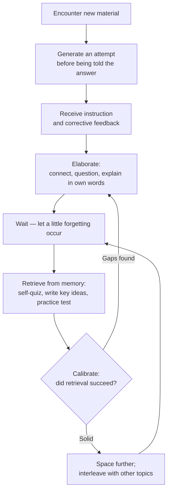

# Make It Stick: The Science of Successful Learning

> Two career cognitive scientists and a professional storyteller team up to explain why the study habits that feel most productive — rereading, highlighting, cramming, drilling one skill at a time — produce the least durable learning, and which effortful, counterintuitive alternatives actually make knowledge stick.

## What This Book Is and Why It Matters

*Make It Stick*, published by Harvard University Press in April 2014, is the rare popular science book written from inside the laboratory rather than looking in from outside. Two of its three authors — Henry L. Roediger III and Mark A. McDaniel — spent their careers running experiments on human learning and memory at Washington University in St. Louis. The third, Peter C. Brown, is a writer and former management consultant who translated their findings into readable prose. According to the authors' official site, the book grew out of a ten-year collaboration among eleven cognitive scientists at six different universities who wanted to close the gap between what learning science knows and what schools, students, and trainers actually do.

Its importance is hard to overstate within this vault's curriculum. Most people's study techniques were never taught to them; they were absorbed from teachers, peers, and intuition. Unfortunately, as the book documents, the techniques that feel best are frequently the ones that work worst. *Make It Stick* became the touchstone text for a quiet revolution in education: university teaching centers recommend it to incoming students, school districts distribute it to faculty, instructors in United States Navy Sea, Air, and Land (SEAL) teams use it to prepare trainees for some of the hardest learning tasks in the world, and Harvard Medical School faculty report teaching its principles in students' first weeks. A graduate student's video summary of the book has reportedly been watched millions of times.

This note treats the book as what it is: an evidence-based practical guide organized around a single unifying principle — that certain difficulties during learning are not obstacles to durable memory but the very mechanism that creates it.

## The Central Question and Governing Thesis

The central question of the book is deceptively simple: **what actually makes learning last?** Not what makes learning feel good, feel fast, or feel efficient in the moment — but what produces knowledge and skill that survive weeks, months, and years, and that remain available when situations change.

The governing thesis can be stated in one sentence: **learning is deeper and more durable when it is effortful, and the subjective feeling of ease that accompanies rereading, cramming, and repetitive drill is a false signal of mastery.** The authors argue that humans are systematically poor judges of their own learning. We mistake fluency — the ease with which information comes to mind while we are still looking at it — for genuine, retrievable knowledge. Because effective strategies such as self-testing, spacing practice over time, and mixing topics together feel harder and slower, learners abandon them in favor of methods that produce comfortable illusions.

From this thesis flows the book's signature concept: **desirable difficulties**. A term associated with the memory researcher Robert Bjork, whose line of work the authors draw on heavily, desirable difficulties are obstacles deliberately introduced into practice — delays before review, mixed-up problem types, attempts to solve problems before being taught the solution — that slow down visible performance during practice while dramatically improving retention and transfer afterward. The paradox sits at the heart of the book: **conditions of practice that make performance improve fastest during training often produce the least learning, and conditions that impede performance during training often produce the most.**

Everything else in the book — six core techniques, a set of demolished myths, a chapter on metacognition, and practical prescriptions — is an elaboration of this single idea.

## Who Wrote It and How It Was Built

Understanding the authorship explains the book's unusual authority.

**Henry L. Roediger III** is the James S. McDonnell Distinguished University Professor of Psychology at Washington University in St. Louis, a Fellow of the American Academy of Arts and Sciences, and one of the world's foremost researchers on memory. He earned his doctorate at Yale and previously taught at Purdue University, the University of Toronto, and Rice University. His laboratory produced some of the most influential modern experiments on what psychologists call the testing effect — the finding that retrieving information from memory strengthens it more than restudying it.

**Mark A. McDaniel** is Professor of Psychology at Washington University with a joint appointment in Education, and Director of the Center for Integrative Research on Cognition, Learning, and Education (CIRCLE). He received his doctorate from the University of Colorado in 1980, and his research spans human learning and memory, prospective memory (remembering to do things in the future), and the application of cognitive science to classrooms.

**Peter C. Brown** is a writer and former management consultant based in St. Paul, Minnesota. His role was narrative: finding the surgeons, pilots, soldiers, athletes, and students whose stories make abstract experimental results concrete.

This division of labor matters for evaluating the book. Unlike many popular treatments of the mind, the scientific claims here come from researchers summarizing their own field — including their own experiments and classroom trials conducted over more than a decade with collaborators such as Pooja K. Agarwal, a cognitive scientist who studies retrieval practice in real schools. The storytelling is a delivery mechanism, not the evidence itself.

## The Book's Architecture

The book unfolds in eight chapters, moving from diagnosis (our understanding of learning is broken), through mechanism (why difficulty works), to prescription (what to do differently). The chapter titles below follow the structure documented by the authors' research collaborators.

| Chapter | Title | Core move |
|---|---|---|
| 1 | Learning Is Misunderstood | Diagnoses the fluency illusion and shows that common study habits create confidence without competence |
| 2 | To Learn, Retrieve | Presents the case for retrieval practice — self-testing — as the foundation of durable learning |
| 3 | Mix Up Your Practice | Explains spaced practice and interleaving, and why massed, blocked practice fails |
| 4 | Embrace Difficulties | Argues that struggle, error, and variation are features of learning, not bugs |
| 5 | Avoid Illusions of Knowing | Turns to metacognition: why we misjudge what we know and how to calibrate |
| 6 | Get Beyond Learning Styles | Debunks the learning-styles myth and redirects attention to evidence-based methods |
| 7 | Increase Your Abilities | Connects durable learning to beliefs about ability, including growth mindset |
| 8 | Make It Stick | Distills concrete tips for students, teachers, and trainers |

To explain the table in plain language: the book opens by convincing you there is a problem, spends the middle chapters building the scientific case for effortful strategies one technique at a time, addresses the psychological traps that keep people using bad methods, dismantles fashionable myths, and closes with a practical toolkit. The progression is deliberately persuasive rather than encyclopedic — each chapter arms the reader against one more reason to revert to comfortable habits.

## Part One: The Problem — Learning Is Misunderstood

### The Fluency Illusion

The book's opening diagnosis concerns a perceptual trap. When you reread a chapter, highlight a passage, or review your notes, the material becomes increasingly familiar. Words look friendly. Concepts seem obvious. This growing ease of processing — what the authors call fluency — is mistaken by nearly everyone, including accomplished students, for evidence that learning has occurred.

It has not, at least not durably. Familiarity with text on a page is not the same as the ability to retrieve that knowledge from memory when the page is closed, the prompt is phrased differently, or the situation is a hospital ward rather than a lecture hall. The distinction between recognition (knowing something when you see it) and recall (producing it from nothing) is the fulcrum on which the whole book turns. Rereading trains recognition. Life demands recall.

The practical consequence is a painful surprise: students who felt thoroughly prepared walk into an exam and find their minds blank, because the exam requires retrieval and their studying never practiced retrieval even once.

### Massed Practice and the Cramming Trap

The second half of the diagnosis targets how we schedule practice. Cramming — massing hours of study into one session before a deadline — genuinely works for tomorrow's test, which is precisely why it survives. It produces rapid, visible gains. But those gains decay with remarkable speed, because the brain was never forced to consolidate anything; it merely held the material in a temporary buffer.

The same logic applies to motor and cognitive skills drilled in long, uninterrupted blocks: practicing one type of problem twenty times in a row, shooting the same shot repeatedly, rehearsing one maneuver until it is smooth. Performance during practice looks excellent. Retention and flexibility afterward are poor. The authors' point is not that these methods teach nothing — they do — but that they optimize for the wrong outcome: short-term performance instead of long-term capability.

## Part Two: The Unifying Principle — Desirable Difficulties

If the problem is that ease deceives us, the solution is to seek out structured difficulty. The authors assemble several distinct phenomena under one conceptual roof:

- **Spacing**: distributing practice over time, with gaps long enough that a little forgetting sets in, forces effortful reconstruction of the memory, which strengthens it.
- **Interleaving**: mixing different but related categories of problems or skills within a session forces the learner to discriminate between them and select the right strategy — a skill that blocked practice never trains.
- **Varied practice**: changing the conditions, contexts, and parameters of practice builds flexible representations that transfer to novel situations.
- **Generation**: attempting an answer before being shown the solution primes deeper learning, even when the attempt is wrong.
- **Retrieval under mild pressure**: testing yourself, especially after delay, does double duty — it strengthens memory and reveals what you do not actually know.

The common thread is that each of these makes practice harder in ways that mirror the demands of real-world use. Real life does not present problems neatly sorted by chapter, immediately after the relevant lesson, with the solution available on request. Practice that resembles those conditions prepares you for them; practice that removes those difficulties prepares you for nothing except more practice.

A crucial qualification runs throughout the book: difficulties are desirable only when the learner ultimately succeeds in overcoming them. Struggle that ends in total failure, with no feedback and no eventual success, teaches frustration rather than skill. The art is calibrating challenge to sit just beyond current ability — a theme this book shares with Anders Ericsson and Robert Pool's [[Peak|Peak]], where the parallel concept is deliberate practice at the edge of one's competence.

## Part Three: The Six Core Practices

### 1. Retrieval Practice — Get It Out to Get It In

The book's centerpiece technique is retrieval practice: closing the book and pulling knowledge out of memory. Self-quizzing, flashcards used properly, writing down the main ideas of a lecture from memory, explaining a concept aloud without notes, taking practice tests — all of these strengthen the underlying memory far more than an equivalent amount of rereading.

The authors describe two profound benefits. First, retrieval directly strengthens the memory trace and interrupts forgetting. Second, it is diagnostic: it tells you honestly what you know and what you do not, whereas rereading tells you only that the text looks familiar. The scientific grounding here is unusually deep — the testing effect has been demonstrated across decades of laboratory work, and Roediger's own research program helped establish it as one of the most reliable findings in cognitive psychology.

Crucially, the evidence extends beyond the laboratory. In classroom experiments conducted in a kindergarten through twelfth-grade (K-12) school district, in collaboration with cognitive scientist Pooja K. Agarwal, the authors report that regular low-stakes quizzing raised students' grades from roughly a C-plus to an A-minus, with benefits persisting across an entire school year. Quizzing functioned as a learning event, not merely a measurement event.

### 2. Spaced Practice — Forgetting as an Ally

Spaced practice exploits the shape of forgetting. Memory decays after initial learning, but each successful retrieval after partial decay rebuilds the trace stronger than before. The practical rule: revisit material after a delay — a day, a few days, a week — rather than immediately and repeatedly. The slight rustiness you feel at the start of a spaced review session is not a sign of failure; it is the sign that the session will do real work.

The book illustrates the stakes with a striking professional example: surgical residents learning microsurgery. One group completed their training in a single intensive session; another group received identical total training spread across multiple sessions over several weeks. When tested about a month later, the spaced group substantially outperformed the massed group — and the consequences of the crammers' degraded skill were not academic abstractions but surgical errors in live operations. Few demonstrations make the cost of intuitive scheduling more visceral.

### 3. Interleaving and Varied Practice — Mixing It Up

Interleaving means arranging practice so that different problem types, skills, or topics alternate within a session, rather than appearing in uniform blocks. The book describes studies in which students who practiced mathematics in mixed sets — different operation types shuffled together — later outperformed students who had practiced each operation in separate blocks, despite the blocked group feeling more confident during practice.

Why does mixing help? Blocked practice lets you coast on a single strategy: once you know every problem in the set is a multiplication problem, you stop asking what kind of problem this is. Interleaving forces the deeper question — *which* procedure fits *this* problem? — which is exactly the question real examinations and real life pose. The same principle appears in athletic training: a batter who faces randomly mixed pitch types develops better pitch recognition and more adaptable responses than one who drills each pitch in isolation, a comparison the authors develop at length.

David Epstein's [[Range|Range]] extends this finding from the practice room to entire careers, arguing that broad, varied experience frequently outperforms early specialization — a macro-scale echo of the interleaving result.

### 4. Elaboration — Wiring New Knowledge Into Old

Elaboration is the practice of explaining new material in your own words, connecting it to what you already know, generating analogies and examples, and interrogating it with "how" and "why" questions. Where retrieval strengthens the memory trace, elaboration multiplies the pathways leading to it, making knowledge easier to reach and easier to apply flexibly.

The learner who asks why a historical event unfolded as it did, or how a biological mechanism would fail if one step changed, is building a web of associations rather than an isolated fact. Elaboration converts memorization into understanding, and understanding is what survives when surface details fade.

### 5. Generation — Attempt Before Instruction

Generation flips the traditional sequence of "teach, then practice." Instead, the learner attempts to solve a problem, write a summary, or produce an answer *before* receiving the solution. Even failed attempts prime deeper learning, because the subsequent instruction lands on ground the learner has already tilled: the correct answer resolves a question the learner personally struggled with, rather than arriving as one more undifferentiated statement.

The book is careful to note that generation works best when followed by timely confirmation and correction. Guessing in a vacuum, without ever learning the right answer, entrenches errors. The productive pattern is: attempt, struggle, then receive the solution while the struggle is fresh.

### 6. Reflection — Retrieval Plus Meaning-Making

Reflection combines retrieval, elaboration, and metacognition into a single habit: regularly reviewing what happened, what worked, what did not, and what connections arise. The book's recurring exemplar is a neurosurgeon who, after difficult operations, mentally replays the procedure — examining his suturing choices, imagining alternatives, planning adjustments for the next case. This nightly rehearsal is retrieval practice applied to expertise, and it compounds over a career.

For students, reflection takes humbler forms: a brief end-of-day review of what was learned, a learning journal, self-explanation of solved problems. The common element is turning experience into articulated lessons rather than letting it evaporate.

### The Learning Loop

The six practices interlock into a repeatable cycle:

Audio description: This flowchart depicts the ideal learning cycle as a loop of seven stages. You encounter new material, first attempting to generate an answer yourself before receiving instruction and feedback. You then elaborate by connecting the material to prior knowledge and explaining it in your own words. Next comes a deliberate waiting period in which some forgetting occurs. You then retrieve the material from memory through self-quizzing or practice tests, and you calibrate by checking whether retrieval succeeded. If gaps appear, you return to elaboration; if the material is solid, you space the next review further out and interleave it with other topics, looping back through waiting and retrieval again. The loop, not the straight line, is the point: durable learning is cyclical, effortful, and self-correcting.

## Part Four: Metacognition — Avoiding Illusions of Knowing

Technique alone cannot save a learner who cannot accurately judge their own knowledge. The book devotes sustained attention to metacognition — awareness and regulation of one's own thinking — because flawed self-assessment is what keeps bad study habits alive.

Three illusions recur. First, the **fluency illusion**: mistaking ease of processing for depth of knowledge. Second, the **illusion of mastery from repeated exposure**: each additional pass over familiar material adds almost nothing, yet feels increasingly secure. Third, **poor calibration of difficulty**: learners consistently predict higher test performance after ineffective strategies like rereading than after effective ones like retrieval practice, and they discard flashcards from their decks too early because the cards feel known before they are truly retrievable.

The remedy is externalization. Feelings are unreliable; tests are not. Frequent low-stakes quizzing, practice examinations under realistic conditions, predicting your score before grading yourself, and seeking honest feedback all replace subjective impression with objective signal. Over time, this recalibrates intuition itself — experienced learners develop better-tuned internal gauges, but only because they spent years checking those gauges against reality. Peter Hollins's [[Thinking-About-Thinking|Thinking About Thinking]] picks up this metacognitive thread and develops it as a subject in its own right.

## Part Five: Myths the Book Dismantles

A distinctive pleasure of the book is its willingness to contradict received wisdom head-on. Four myths take the heaviest fire.

| Popular belief | What the evidence shows |
|---|---|
| Matching instruction to a student's learning style (visual, auditory, and so on) improves outcomes | There is no credible empirical support; teaching to purported styles does not beat teaching well by evidence-based methods |
| Learning should be made easy and error-free | Effortful retrieval, spacing, and even productive errors deepen learning; ease is a warning sign, not a virtue |
| Rereading and highlighting are studying | They build recognition and fluency illusions while leaving recall weak |
| Cramming works | It works for immediate performance and fails for retention; spaced practice dominates for anything that must last |

To unpack the table: the learning-styles critique is among the book's most cited contributions. The idea that each person learns best through a preferred sensory modality is enormously popular in education, yet controlled studies find no advantage for matching instruction to assessed styles. The authors redirect the energy spent diagnosing styles toward methods with actual evidentiary support.

On errors, the book pushes against the doctrine of errorless learning. In one experiment it describes, students who made errors during study learned more than peers who did not — and, tellingly, the erring students did not recognize their own advantage. Errors during retrieval, promptly corrected, mark the exact locations where memory needs reinforcement. An important boundary condition deserves note, however: clinicians working with people who have severe memory impairments sometimes deliberately use errorless techniques, because for such learners errors can themselves become entrenched. The book's defense of productive error assumes a learner whose memory can distinguish corrected mistakes from confirmed facts.

## The Evidence Base: How Strong Is It?

Assessing the quality of support behind each recommendation is essential for using this book responsibly. The evidence is not uniform across techniques, and pretending otherwise would repeat the book's own sin of substituting feeling for calibration.

**Strongest support: retrieval practice and spacing.** These rest on decades of converging laboratory experiments, replicated across materials, ages, and formats, plus the classroom trials the authors and collaborators ran in real school districts — including the K-12 quizzing studies reporting grade improvements from roughly C-plus to A-minus sustained across a school year. This is about as good as educational psychology evidence gets.

**Strong support with narrower scope: interleaving.** Laboratory and classroom studies — including the mixed-practice mathematics studies and the baseball pitch-recognition findings — show meaningful advantages for mixed over blocked schedules, particularly for discrimination among confusable categories. The literature here is younger and somewhat smaller than for retrieval and spacing, and effects depend on sensible category selection, but the direction of the evidence is consistent.

**Supportive but broader-brush: elaboration, generation, and reflection.** These draw on well-established cognitive principles — depth of processing, generation effects, self-explanation — and fit plausibly within the book's framework, though the individual techniques have somewhat more heterogeneous literatures than the big three.

**Adjacent borrowing: growth mindset.** The chapter on increasing abilities incorporates Carol Dweck's research on beliefs about intelligence, summarized in her book [[Mindset|Mindset]]. The book presents it as complementary scaffolding for effortful learning. Readers should know that in the years since publication, the size of mindset interventions in ordinary classrooms has been actively debated in the research community; the core association between believing abilities are improvable and persisting through difficulty remains plausible, but it should be held more lightly than the retrieval and spacing findings.

**Professional-domain evidence.** The microsurgery study with surgical residents stands out because it demonstrates the stakes outside academia: identical training hours, radically different retention, measured in operative performance weeks later.

Overall verdict: this is one of the most empirically grounded books in the entire popular learning genre. Its weakest links are borrowed constructs at the edges, not its core.

## Strengths: What the Book Does Best

First, **authorial credibility matched to communicative skill**. Very few books pair active, eminent researchers with a professional storyteller. The result is claims you can trust delivered through narratives — pilots, surgeons, Marines, students — that make the science memorable. The stories model the book's own advice: they elaborate the principles, connecting abstraction to lived cases.

Second, **actionability at zero cost**. Every recommended technique can be implemented tonight with a pencil and a timer. No software, no courses, no purchases. This gives the book unusual leverage per page.

Third, **myth destruction with receipts**. Rather than dismissing popular beliefs, the book explains *why* they feel true — the fluency mechanisms that make rereading satisfying, the intuitive appeal of matching teaching to styles — which inoculates readers against relapse far better than mere contradiction.

Fourth, **institutional traction as external validation**. Adoption by military training organizations, medical schools, university teaching centers, and school districts suggests the ideas survive contact with high-stakes practice, where feedback is unforgiving.

Fifth, **honest treatment of the learner's inner game**. By pairing technique chapters with metacognition and mindset chapters, the book acknowledges that the obstacle is not ignorance of good methods but the psychological pull of bad ones.

## Weaknesses, Criticisms, and Limits

An honest note must also map where the book strains.

**Narrative density can blur evidential weight.** The storytelling that makes the book pleasurable also flattens distinctions between rock-solid findings and suggestive illustrations. A reader can finish the book feeling that every anecdote carries equal proof value. The surgical resident story is powerful, but single vivid cases supplement rather than substitute for the aggregate data, and the book does not always police that boundary explicitly.

**The techniques differ in evidential maturity, but the rhetoric is uniform.** As detailed above, retrieval practice and spacing rest on mountainous evidence; interleaving is robust but younger; generation and reflection are sound but broader-brush. The book's confident tone rarely signals these gradations, leaving calibration work to the reader.

**Difficulty must be calibrated, and the book underplays failure modes.** Desirable difficulties are desirable only within a band. Chronic overwhelming failure breeds learned helplessness and avoidance — a drawback the surrounding literature acknowledges and the book treats too lightly. Similarly, the enthusiasm for productive errors needs the clinical caveat noted earlier: for learners with severe memory impairment, errorless approaches exist precisely because errors can consolidate. The book's principles assume typical learners and adequate feedback loops.

**Novice support is a live tension.** Researchers in the cognitive load tradition caution that minimally guided problem-solving can overwhelm true beginners, who often benefit from worked examples before generation attempts. The book's generation advice is best read as "attempt, then promptly instruct," but readers can overextend it into pure discovery learning, which the broader evidence does not support for novices.

**The implementation gap goes largely unaddressed.** Knowing about desirable difficulties does not make learners enjoy them. Students rate smooth, easy lectures higher even when they learn less from them, and institutions reward whatever satisfies immediate evaluations. The book changes minds more easily than it changes incentives; systemic adoption remains incomplete more than a decade on.

**Some borrowed science has aged unevenly.** The growth mindset material, as noted, entered a period of replication debate after publication. The neuroscience-flavored framing occasionally reaches further than the underlying brain evidence strictly supports. Neither issue undermines the core, but both counsel holding peripheral claims loosely.

**Transfer claims deserve modesty.** Much of the strongest evidence measures retention and near transfer — performing the same or closely related tasks later. Claims about far transfer to wholly different domains are intuitively appealing but rest on thinner ground, a caution that applies to the learning sciences generally rather than to this book uniquely.

None of these weaknesses overturns the central thesis. They define the responsible way to hold it: strongly for retrieval, spacing, and interleaving; thoughtfully for the rest.

## Benefits and Costs at a Glance

| Benefits | Costs and cautions |
|---|---|
| Techniques are free, immediate, and broadly applicable | Effective practice feels worse, requiring tolerance for discomfort |
| Core claims rest on unusually strong replicated evidence | Peripheral claims (mindset, some neuro-framing) have aged less evenly |
| Debunks costly myths (styles, rereading, cramming) with mechanisms, not mockery | Anecdote-rich style can mask differences in evidence strength |
| Addresses metacognition, attacking the root cause of bad habits | Does little about incentive structures that reward easy-feeling teaching |
| Validated in high-stakes professional training environments | Misapplied difficulty can discourage fragile or novice learners |

Reading the table plainly: the left column lists why the book earned its reputation — trustworthy authors, free techniques, myth-busting with mechanisms, and adoption where stakes are highest. The right column lists what a critical reader must supply independently: tolerance for the discomfort of effective practice, skepticism toward the book's softer edges, awareness that stories are illustrations rather than statistics, and care to match difficulty to the learner's current level.

## Putting It to Work

### For students

Replace passive review with a weekly rhythm. After each class or reading session, close the book and write the central ideas from memory. Convert notes into questions and quiz yourself with them, keeping flashcards in rotation well past the point where they feel known. Schedule reviews at expanding intervals — next day, then a few days, then a week — accepting the rustiness that greets each session. Mix problem types when preparing for any assessment that will mix them. Ask "how" and "why" of every major concept, and connect it to something you already understand. Before exams, take practice tests under timed, closed-book conditions, then grade yourself harshly and study the gaps, not the comforts. Cal Newport's [[How-to-Become-a-Straight-A-Student|How to Become a Straight-A Student]] offers tactical companions for the student workflow, and Stella Cottrell's [[The-Study-Skills-Handbook|The Study Skills Handbook]] packages similar science into a comprehensive skills manual.

### For teachers and trainers

Build frequent, low-stakes quizzing into every unit, and make quizzes cumulative so old material keeps getting retrieved. Interleave homework and problem sets rather than sorting them by type. Teach students explicitly about the fluency illusion — learners abandon effective methods less when they understand why effective methods feel bad. Normalize error as information: run attempts before instruction where feasible, then correct quickly. Design training that varies conditions, mirroring the variability of real performance. Ken Bain's [[What-the-Best-College-Teachers-Do|What the Best College Teachers Do]] examines the teacher side of fostering deep learning, complementing this book's learner-side emphasis.

### For self-directed learners and professionals

Structure any self-teaching project around retrieval and spacing from day one: define what you will be able to *do*, test yourself against that definition regularly, and let review schedules stretch as mastery grows. Scott Young's [[Ultralearning|Ultralearning]] provides an ambitious framework for such projects built substantially on these same principles, and Barbara Oakley's [[A-Mind-for-Numbers|A Mind for Numbers]] translates the identical science for mathematics and technical subjects, where the fluency illusion is especially treacherous. Professionals maintaining certifications or skills should replace annual cram-refreshers with short, spaced, mixed retrieval sessions — the microsurgery evidence suggests careers may depend on it.

### A minimal protocol

If you adopt only five habits from this book: retrieve instead of reread; space your reviews; mix your practice; attempt before you are taught; and test to calibrate rather than trusting your sense of mastery. Benedict Carey's [[How-We-Learn|How We Learn]], a parallel journalistic tour of the same research landscape, reaches substantially overlapping conclusions — independent convergence that strengthens confidence in the core recommendations.

## How It Connects to the Wider Shelf

Within this vault, *Make It Stick* functions as the empirical anchor of the Learning Science shelf. Its relationships run in several directions. With [[Peak|Peak]] it agrees on the centrality of effortful, feedback-rich practice at the edge of ability, though Ericsson and Pool focus on expert performance while Brown, Roediger, and McDaniel focus on durable memory. With [[Range|Range]] it shares the interleaving insight, generalized from practice sessions to life trajectories. With [[Mindset|Mindset]] it forms a direct extension: the book imports Dweck's beliefs-about-ability research to explain why some learners embrace difficulty and others flee it. Motivation supplies the fuel that desirable difficulties consume, which ties the book to Daniel Pink's [[Drive|Drive]] on autonomy and mastery, Angela Duckworth's [[Grit|Grit]] on perseverance, and Ian Leslie's [[Curious|Curious]] on the questioning disposition that powers elaboration. Neil Postman's [[The-End-of-Education|The End of Education]] offers the philosophical counterweight, asking what learning is *for* — a question this book deliberately brackets in favor of how learning mechanically works. Jim Kwik's [[Limitless|Limitless]] shares the ambition of upgrading learning but rests on a far thinner evidential base, making *Make It Stick* the more reliable prescription. Nelson Dellis's [[Remember-It!|Remember It!]] contributes the mnemonic specialist's toolkit, and Sönke Ahrens's [[How-to-Take-Smart-Notes|How to Take Smart Notes]] embeds elaboration and retrieval into a permanent note-taking system — both natural downstream applications of this book's principles.

## Five Things to Remember

1. **Ease is a false signal.** The fluency you feel while rereading or highlighting is familiarity with the page, not knowledge in your head. If studying feels effortless, suspect it is working poorly.
2. **Retrieval beats review.** Closing the book and pulling ideas out of memory — self-quizzing, writing from recall, practice tests — strengthens memory and exposes gaps in one move. Every hour of retrieval is worth more than an hour of review.
3. **Let forgetting begin, then rebuild.** Space your practice so a little rustiness sets in first. The effortful reconstruction that follows is precisely what makes learning durable; cramming skips it entirely.
4. **Mix what you practice.** Interleaving related topics and varying conditions forces you to choose strategies, not just execute them — and choosing is what tests and real life demand.
5. **Grade yourself with tests, not feelings.** Your sense of mastery is systematically miscalibrated. Low-stakes quizzes, honest feedback, and predicted-versus-actual scores are the only trustworthy instruments for knowing what you know.

## TTS-Friendly Recap

Here is the whole book in spoken form. Make It Stick was written by a storyteller named Peter Brown together with two eminent memory scientists, Henry Roediger and Mark McDaniel, and published by Harvard University Press in twenty fourteen. Its message begins with an uncomfortable discovery: the study methods almost everyone uses, like rereading notes, highlighting textbooks, and cramming before exams, feel productive but create only an illusion of mastery. The ease you feel while reviewing familiar material is not learning. It is familiarity, and it fades almost immediately when the book closes.

What actually builds lasting memory is effort. The authors call the useful kind of effort desirable difficulty. Their flagship technique is retrieval practice: instead of reviewing, close the book and try to recall the material. Quiz yourself. Write down the main ideas from memory. Take practice tests. Pulling knowledge out of your head strengthens it far more than putting it in again, and it honestly reveals what you do not yet know. In real classrooms, regular low-stakes quizzing raised student grades dramatically, and the benefits lasted the whole school year.

The second technique is spacing. Spread your practice over days and weeks instead of massing it into one session. When you start a review session and feel a little rusty, that is good. Rebuilding a partly forgotten memory is what makes it strong. The third technique is interleaving. Mix different types of problems and topics within a session instead of drilling one kind at a time. Mixing feels harder and slower, but it teaches you to tell problems apart and pick the right method, which is exactly what exams and real life require.

Around these three pillars the authors add elaboration, meaning you should explain ideas in your own words and connect them to what you already know; generation, meaning you should attempt answers before being taught them, because even wrong attempts prepare the mind to learn; and reflection, meaning you should regularly review what happened, what worked, and what you would do differently, the way a surgeon mentally rehearses an operation at night.

The book also demolishes popular myths. There is no good evidence that teaching to individual learning styles improves results. Errors during practice, when corrected, actually help learning. And our self-assessment is chronically unreliable, so we must calibrate with tests and feedback rather than trusting our feelings of mastery. The book closes with practical tips for students, teachers, and trainers, and grounds its credibility in its authorship: these are researchers summarizing their own field, backed by a decade of classroom experiments.

Use the book with open eyes. Its core findings on retrieval, spacing, and interleaving are among the best-supported in the science of learning. Its edges, like growth mindset and some neurological framing, are softer. And remember the deepest lesson: effective learning feels harder, slower, and less pleasant than ineffective learning. Once you accept that discomfort is the price of durability, every technique in the book follows naturally.

## Sources and Further Reading

- Harvard University Press — official book page for *Make It Stick: The Science of Successful Learning*: https://www.hup.harvard.edu/books/9780674729018
- Official *Make It Stick* site (Harvard University Press) — about the book, authors, and big ideas: https://www.makeitstick.com/
- Pooja K. Agarwal, RetrievalPractice.org — chapter-by-chapter overview and free resources: https://www.retrievalpractice.org/make-it-stick
- Psychology Today — contributor profiles of McDaniel, Roediger, and Brown: https://www.psychologytoday.com/us/contributors/mark-mcdaniel-phd-henry-l-roediger-iii-phd-and-peter-c-brown
- College & Research Libraries review (ACRL): https://crl.acrl.org/index.php/crl/article/view/16446/17892
- Wiley Online Library review PDF: https://ift.onlinelibrary.wiley.com/doi/epdf/10.1111/1541-4329.12075
- Books That Slay — summary and key lessons: https://booksthatslay.com/make-it-stick-summary/
- Mind My Learning — book summary of strategies for effective learning: https://mindmylearning.com/blog/make-it-stick-book-summary/
- Unseen Founder — founder-oriented review: https://unseenfounder.com/book/make-it-stick/
- Shortform — PDF summary preview: https://www.shortform.com/pdf/make-it-stick-pdf-peter-c-brown-henry-roediger-mark-mcdaniel
- Shortform — book summary page: https://www.shortform.com/summary/make-it-stick-summary-peter-c-brown-henry-roediger-mark-mcdaniel
- Summrize — chapter-anchored summary: https://www.summrize.com/books/make-it-stick-summary

Note on sourcing: the two scholarly review items (Wiley and ACRL) were retrieved without accessible content in this note's research pass; they are listed for completeness and further reading. All substantive claims above derive from the publisher's page, the authors' official site, the collaborating researcher's chapter summaries, and the summary sources, with editorial analysis clearly separated from the authors' claims.

## Related Books

- [[A-Mind-for-Numbers|A Mind for Numbers]] — Barbara Oakley — Complementary angle: translates the same learning science for mathematics and technical subjects, where the fluency illusion bites hardest.
- [[Ultralearning|Ultralearning]] — Scott Young — Extension: builds self-directed intensive learning projects on retrieval, spacing, and directness principles this book establishes.
- [[Peak|Peak]] — Anders Ericsson; Robert Pool — Agreement with a different lens: deliberate practice and desirable difficulties both locate mastery in effortful work at the edge of ability.
- [[Range|Range]] — David Epstein — Extension: generalizes interleaving and varied practice from the practice session to entire careers, arguing breadth beats early specialization.
- [[How-We-Learn|How We Learn]] — Benedict Carey — Parallel treatment: an independent journalistic account reaching overlapping conclusions, whose convergence strengthens confidence in the shared core recommendations.

## Navigation

← Previous: [[Peak|Peak]]
↑ Category: Learning Science & Cognitive Load
→ Next: [[Ultralearning|Ultralearning]]
