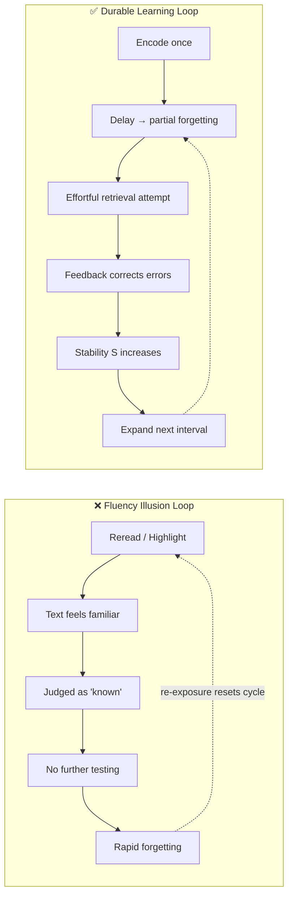

# 01 · Core Thesis & Mental Models

## The Central Argument

Most learners operate on an intuitive model: *exposure + repetition = mastery*. Cognitive science refutes this. In the book's opening experiments, college students could not identify the correct image of a penny despite a lifetime of exposure (Nickerson & Adams, 1979), and a veteran UCLA professor could not locate the nearest fire extinguisher after decades of walking past one. **Repeated exposure builds familiarity, not retrievable knowledge.**

The authors' thesis inverts the intuition:

> [!IMPORTANT]
> **Conditions of practice—not quantity of practice—determine durability.** Strategies that slow visible performance during acquisition (spacing, interleaving, testing, variation) accelerate long-term retention and transfer. Strategies that accelerate visible performance (massing, rereading) produce rapid gains that evaporate.

This rests on five governing mental models:

### Mental Model 1: Desirable Difficulties (Bjork)

Robert Bjork's framework holds that some obstacles during learning—delayed feedback, partial forgetting, mixed problem types—force deeper processing and strengthen memory traces. Difficulty is only "desirable" when it targets the *retrieval and application* of knowledge rather than merely making access harder.

### Mental Model 2: Fluency ≠ Mastery

Ease of processing is systematically misread as evidence of learning. Rereading makes text feel smooth; smoothness signals "I know this"; the signal is false. This is the root of the **illusion of knowing**.

### Mental Model 3: Retrieval Is the Engine

"The act of retrieving learning from memory has two profound benefits: it tells you what you know and don't know, and it strengthens the memory of what you know." Every successful recall modifies the memory itself—this is the [[Testing-Effect|testing effect]].

### Mental Model 4: Forgetting Is an Ally

Some forgetting between sessions is functional. Retrieval succeeds most powerfully when it must reconstruct a partially decayed trace:

$$R(t) = e^{-t/S}$$

where $R$ is retention probability, $t$ is time since last retrieval, and $S$ is memory *stability*. Each effortful, successful retrieval increases $S$, flattening the decay curve. Optimal review occurs near the point of incipient forgetting—early enough to succeed, late enough to require effort. Expanding schedules exploit this:

$$I_{n+1} \approx k \cdot I_n, \quad k > 1$$

where successive review intervals $I_n$ grow geometrically (e.g., 1 day → 3 days → 1 week → 2 weeks).

### Mental Model 5: Calibration Through Testing

Because introspection is unreliable, learners need external instruments—quizzes, predictions scored against outcomes—to align confidence with actual competence.

## The Two Loops

> [!TIP]
> The diagnostic question for any study session: *"Did I have to pull anything out of memory, or did I only push things in?"* Only pulling strengthens.

---
