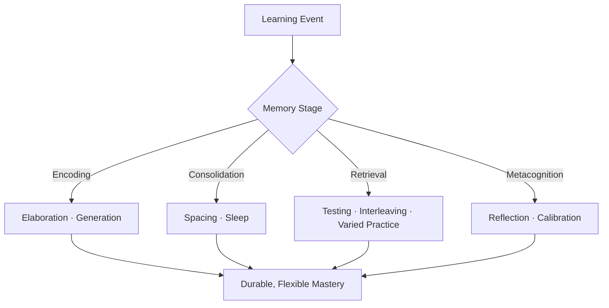

# 02 · Key Concepts & Chapters

## Chapter Synthesis Map

## Ch. 1 — Learning Is Misunderstood

Establishes the diagnosis: learners default to low-utility strategies because they *feel* right. Mastery requires eight practices—retrieval, spacing, interleaving, varied practice, elaboration, generation, reflection, calibration—none of which resemble passive review. Key exhibit: the penny-recognition failure proving that sheer exposure without retrieval leaves almost no usable trace.

## Ch. 2 — To Learn, Retrieve

The foundational chapter on the **testing effect**. In Roediger & Karpicke's landmark experiments, students who practiced recalling a passage far outperformed repeated readers on a delayed test one week later—even though the rereaders predicted they would win. Retrieval practice is not assessment; it is the *learning event itself*.

> [!EXAMPLE]
> **Classroom proof:** In multi-year K–12 studies run with researcher Pooja Agarwal, brief low-stakes quizzes embedded in units raised end-of-unit exam performance by roughly a full letter grade (≈ C+ → A−), with benefits persisting across an entire school year versus control classes reviewing the same content.

Neurosurgeon Mike Ebersold's post-surgery mental replay—re-running difficult steps, imagining alternative suture placements, then testing variations the next day—is presented as naturalistic retrieval-plus-elaboration: reflection that rehearses memory from multiple angles.

## Ch. 3 — Mix Up Your Practice

Three structural manipulations of practice:

| Strategy | Definition | Why It Works | Feels Like |
|---|---|---|---|
| **Spaced practice** | Distribute sessions over time | Retrieval occurs after partial forgetting ($e^{-t/S}$ decay), forcing reconstruction | Rusty, slower |
| **Interleaved practice** | Mix related problem/skill types within a session | Trains *discrimination*: selecting the right method, not just executing it | Confusing, error-prone |
| **Varied practice** | Vary conditions/context of a single skill | Builds adaptable motor/cognitive schemas that transfer to novel conditions | Unpolished |

Key evidence: surgical residents trained in microsurgery under a spaced schedule dramatically outperformed crammed peers at one-month follow-up—the crammers' errors included permanent nerve damage in lab animals. In math-learning studies (Doug Rohrer's line of work), interleaved homework groups, though scoring worse during practice, substantially beat blocked groups on delayed tests. A classic bean-toss study (Kerr & Booth) showed children practicing at varied distances hit a novel target better than specialists at one fixed distance.

> [!WARNING]
> **Massed practice manufactures its own praise.** Rapid within-session improvement is mistaken for learning; the gains fade within days. Blocked practice also hides a critical skill: knowing *which* procedure a problem calls for.

## Ch. 4 — Embrace Difficulties

Formalizes Bjork's **desirable difficulties** and attacks the myth of errorless learning. In pretesting experiments (Kornell, Hays & Bjork), students forced to guess answers *before* instruction—even guessing entirely wrong—learned more from subsequent correction than students who merely read the answers. Generation primes the mind to encode the solution deeply. Marine officer Mia Blundetto's parachute-training narrative illustrates learning-through-error under real stakes: mistakes, analyzed and corrected, are the curriculum.

## Ch. 5 — Avoid Illusions of Knowing

Catalogs the sources of false confidence:

| Illusion Source | Mechanism | Antidote |
|---|---|---|
| Rereading / highlighting | Fluency misread as mastery | Closed-book self-testing |
| Cramming | Short-term availability mistaken for permanence | Spaced cumulative review |
| Prior knowledge | Old models distort new input | Test against feedback |
| Hindsight bias | "I knew it all along" | Predict *before* seeing answers |
| Social consensus | Group agreement substitutes for verification | Independent retrieval first |
| Poor calibration | Unskilled-and-unaware (Dunning–Kruger pattern) | Scored predictions + error logs |

The chapter introduces **dynamic testing** (test → targeted feedback → retest) as superior to static assessment for revealing latent ability and guiding study allocation.

## Ch. 6 — Get Beyond Learning Styles

Debunks the "meshing hypothesis"—that matching instruction to visual/auditory/kinesthetic preferences improves outcomes. The rigorous-review standard (Pashler, McDaniel, Rohrer & Bjork, 2008) finds no credible crossover-interaction evidence. What matters is the *demands of the task*, not the learner's preferred
