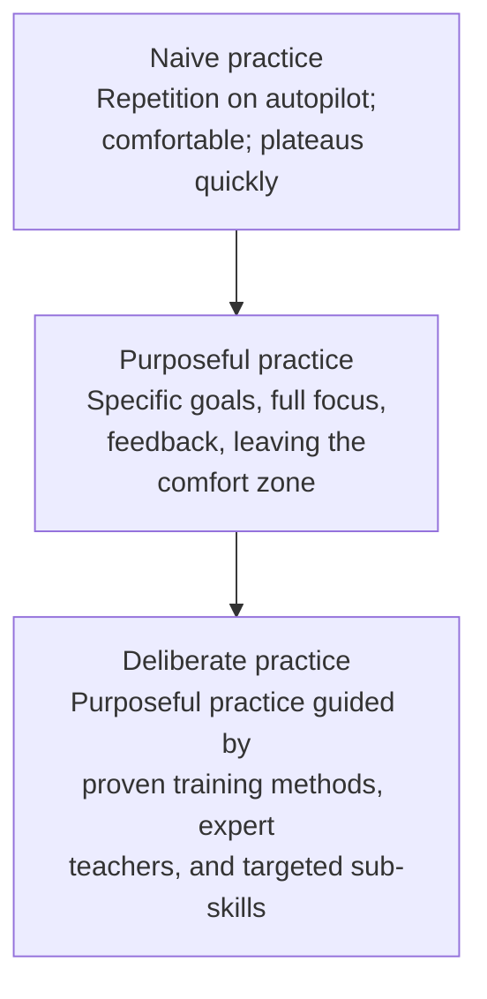
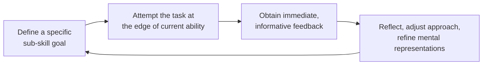

# Peak: Secrets from the New Science of Expertise

> "If you never push yourself beyond your comfort zone, you will never improve." — Anders Ericsson and Robert Pool, *Peak*

*Peak* (2016) is the capstone popular account of psychologist K. Anders Ericsson's thirty-year research program on expert performance, written with veteran science writer Robert Pool. Published in the United States by Eamon Dolan Books / Houghton Mifflin Harcourt on April 5, 2016 (with a UK edition from Bodley Head under the alternate subtitle *How All of Us Can Achieve Extraordinary Things*, and a HarperCollins paperback in 2017), the book runs about 336 pages and is aimed squarely at a general audience. Its job is twofold: to explain, in plain language, what Ericsson's decades of laboratory and field research actually showed about how people acquire extraordinary skill — and to correct the distorted version of that research that had spread through popular culture as Malcolm Gladwell's "10,000-hour rule" from *Outliers* (2008). Ericsson himself published a corrective essay in Salon around the book's release, arguing that his findings had been oversimplified into a magic number when the real message was always about the *quality* of practice, not its raw quantity.

## What This Book Is and Why It Exists

Ericsson spent his career studying chess champions, violin virtuosos, star athletes, memory competitors, surgeons, and other top performers, asking a deceptively simple question: what separates the best from everyone else? His answer — that superior performance comes from a specific, learnable *kind* of practice rather than from innate gifts — made him one of the most cited psychologists of his generation and the intellectual spine behind bestselling books such as *Moonwalking with Einstein*, *Outliers*, and *How Children Succeed*. Yet that visibility came at a cost. When Gladwell compressed Ericsson's findings into the slogan that ten thousand hours of practice makes anyone an expert, the nuance collapsed: hours became a talisman, and the crucial distinctions between types of practice vanished.

*Peak* exists to restore those distinctions. It is organized as an introduction ("The Gift") followed by eight chapters that climb a conceptual ladder: the power of purposeful practice, the adaptability of the human body and brain, mental representations, the "gold standard" definition of deliberate practice, applying the principles at work, applying them in everyday life, the long road to extraordinary performance, and finally the awkward question of how to explain apparent natural talent. Within this vault, the book functions as a hub: notes such as [[Make-It-Stick|Make It Stick]], [[Ultralearning|Ultralearning]], and [[Grit|Grit]] all engage with, extend, or depend on the framework articulated here, which is a strong signal of its foundational role in the learning-science canon.

## The Governing Question and Thesis

The central question of *Peak* is: **where does expert performance actually come from?** The folk answer is talent — some people are simply born with gifts. Ericsson's answer, stated with unusual boldness, is that the right sort of practice, carried out over a sufficient period of time, leads to improvement, and that nothing else reliably does. The book's thesis can be unpacked into four claims:

1. **Ordinary experience does not produce expertise.** People plateau at "acceptable" levels in driving, typing, cooking, or professional work because mere repetition automates behavior rather than improving it.
2. **Improvement requires leaving the comfort zone.** Skill grows only when training targets specific weaknesses just beyond current capability, with feedback and adjustment.
3. **Expertise lives in mental representations** — rich internal models built through years of structured practice — not in raw information accumulation or general intelligence.
4. **Apparent talent is largely the visible tip of invisible training histories**, beginning earlier and running deeper than observers realize.

The tone is empowering but demanding: nearly anyone can improve dramatically at almost anything, but only by practicing in ways that are deliberately uncomfortable, precisely targeted, and relentlessly informed by feedback.

## The Ladder of Practice: From Naive Repetition to Deliberate Practice

The book's most useful contribution is a taxonomy of practice types. Most people occupy the bottom rung their entire lives without noticing.

**Naive practice** is doing the activity itself: playing familiar songs on the guitar, driving the commute, swinging golf clubs at a range, answering the same kind of emails. It feels like practice because it involves the skill, but it runs on autopilot. Once performance reaches an acceptable level, it stabilizes — sometimes for decades — because automaticity removes exactly the conscious attention that improvement requires.

**Purposeful practice** is what happens when someone injects intention into that routine. Ericsson and Pool define it by five features: well-defined, specific goals (a session succeeds only if its goal is met); breaking long-term ambitions into reachable sub-goals; full concentration on the task; feedback that reveals how you are doing; and stepping outside your comfort zone. A pianist who isolates eight difficult bars, plays them slowly with total attention, records herself, and listens for errors is practicing purposefully. The same pianist running through a concert program start to finish is not.

**Deliberate practice**, the book's "gold standard," is purposeful practice plus a set of conditions that mostly exist only in mature training fields like classical music, ballet, chess, and competitive sport. It develops skills that others have already mastered, meaning proven training methods exist; it typically involves a teacher or coach who designs the work; it demands near-maximal effort at the edge of ability; it targets specific sub-skills rather than "getting better" in general; and it builds and refines mental representations through constant feedback and modification. Deliberate practice is rarely fun in the moment — it is work — and it is intense enough that even elite performers sustain it only in limited daily doses.

Audio description: This diagram shows a three-step ladder rising from left-bottom to right-top. The first box, naive practice, is described as repetition on autopilot that is comfortable and plateaus quickly. An arrow leads up to the second box, purposeful practice, characterized by specific goals, full focus, feedback, and leaving the comfort zone. A second arrow rises to the third box, deliberate practice, described as purposeful practice guided by proven training methods, expert teachers, and targeted sub-skills. The visual message is that each practice type contains and extends the one below it.

The following table condenses the contrasts the authors draw throughout the first half of the book.

| Dimension | Naive practice | Purposeful practice | Deliberate practice |
|---|---|---|---|
| Goal | None beyond doing the activity | Specific, measurable session goals | Targeted improvement of identified sub-skills |
| Attention | Autopilot | Fully focused | Fully focused, high intensity |
| Comfort zone | Stays inside it | Pushes just beyond it | Operates at the edge, near-maximal effort |
| Feedback | Incidental or absent | Actively sought | Systematic, often coach-mediated |
| Training method | Whatever the person already knows | Self-designed | Drawn from an established body of expert knowledge |
| Typical result | Rapid early gains, then permanent plateau | Steady improvement while sustained | The development path of genuine experts |

Read the table as a diagnostic: locate your current practice in the left column, and the gaps that open as you move rightward are precisely the levers the book asks you to pull. The critical insight is that the columns are not about talent or personality; they are about *design*. Anyone can convert naive practice into purposeful practice tomorrow by adding a goal, a focus requirement, and a feedback channel — and the book documents dramatic gains from exactly that conversion.

## Harnessing Adaptability: Why Bodies and Brains Rebuild Under Pressure

Chapter two supplies the biological engine behind the whole framework. Human bodies prefer stability — the regulated internal balance scientists call homeostasis. Exercise disrupts that balance, and the body responds not merely by recovering but by rebuilding slightly beyond its previous baseline: muscles add fibers, lungs expand capacity, hearts pump more efficiently. Crucially, the same logic applies to the brain. Ericsson and Pool marshal evidence that training physically reshapes neural tissue. Their most famous illustration is the London taxi driver research: drivers who spend years memorizing the city's sprawling street network show measurable structural enlargement in hippocampal regions tied to spatial memory, with the effect scaling with years of experience. The authors' summary line captures the mechanism: regular training leads to changes in the parts of the brain that are challenged by the training, and the brain adapts by rewiring itself to carry out the challenged functions more effectively. They add that if you practice something enough, the brain will repurpose neurons for the task even when those neurons already have other jobs.

Two corollaries follow, and both matter practically. First, adaptation requires *progressive overload*: challenge must sit just outside current capacity. Too little stress produces no change; too much produces injury or burnout. Second, adaptation is reversible — stop training and the acquired changes fade. Potential, in this view, is not a fixed inheritance but a moving frontier that training either pushes outward or abandons.

The most striking application the book offers is absolute pitch — the ability to name any heard note instantly, long considered a rare inborn gift available only to a lucky few, almost always revealed in childhood. Ericsson points to training experiments in which young children, taught with appropriate methods during a narrow developmental window, mostly acquired reliable absolute pitch. If a capacity this celebrated as "gifted" can be trained into existence, the authors ask, what else have we wrongly filed under talent?

## Mental Representations: The Real Currency of Expertise

If adaptability is the engine, mental representations are the cargo. Ericsson and Pool define mental representations as internal structures — encoded in the physiology of neurons — that correspond to objects, patterns, situations, or sequences in the external world. Everyone has them: a mental image of your car, a sense of how a face looks, the feel of a gear shift. What distinguishes experts is the *quality and quantity* of these representations. Through years of practice, top performers build highly complex, highly specialized models of the situations their field throws at them — the vast space of chess positions, the sound of a slightly flat interval, the subtle precursors of a patient's deterioration.

The book traces this idea back to classic chess research from the 1970s, in which masters and novices were shown briefly positioned boards. Masters reconstructed real game positions almost perfectly while novices floundered — yet when pieces were scattered randomly, masters lost nearly all their advantage. The lesson: experts do not hold superhuman memories; they hold millions of meaningful chunks, and meaningful material slots effortlessly into those chunks. A journalist named Joshua Foer, who used exactly these memory-training principles to win the United States Memory Championship, drew on Ericsson's research for his account of that year, and his trajectory — from average rememberer to national champion — is one of the book's living proofs of concept.

Three properties of mental representations drive the book's practical advice. First, they are **domain-specific**: the models that make a great surgeon do nothing for a golfer, which is why the authors insist there is no such thing as training a "general" skill and why promises of universal transfer should be distrusted. Second, they are **double-edged tools**: representations let you detect patterns, anticipate outcomes, and diagnose your own errors — which means they are simultaneously the *product* of practice and the *instrument* that makes further practice effective. Third, they are **buildable**: studying how experts analyze situations, imitating exemplary performances, and reflecting systematically on your own attempts all thicken the models. The book's memorable formulation is that what sets expert performers apart from everyone else is the quality and quantity of their mental representations — and since representations are acquired, they can be deliberately constructed.

## The Gold Standard: What Qualifies as Deliberate Practice

Chapter four assembles the full definition. Deliberate practice, properly so called, has these requirements: it develops skills that already have established, effective training methods; it takes place outside the comfort zone at genuinely demanding effort levels; it pursues well-defined, specific goals rather than vague overall improvement; it demands full attention and cannot be done while distracted or fatigued; it depends on and simultaneously improves mental representations; it incorporates continuous feedback and modification in response to that feedback; and it works by building or modifying pre-existing skills step by step. Because these conditions are stringent, the honest scope of the concept is narrower than pop culture assumed: it flourishes in fields with long pedagogical traditions and objective performance standards, and it must be *engineered from scratch* in fields without them.

Audio description: This diagram is a closed loop with four stations connected by arrows flowing clockwise. Station one: define a specific sub-skill goal. Arrow to station two: attempt the task at the edge of current ability. Arrow to station three: obtain immediate, informative feedback. Arrow to station four: reflect, adjust the approach, and refine mental representations. An arrow returns from station four to station one, emphasizing that deliberate practice is an iterative cycle rather than a straight line, with each revolution sharpening both the skill and the internal models guiding it.

The loop diagram above is the operational heart of the book. Break any link — no clear goal, no real stretch, no feedback, no reflection — and the cycle degrades into motion without progress. The authors' recurring warning is that the loop is *uncomfortable by design*: if practice feels easy and pleasant, it is probably naive practice wearing a costume.

## Putting It to Work: Jobs, Everyday Life, and the Long Road

### Deliberate practice at work

Most professional development transmits *knowledge* — lectures, courses, certifications — when performance depends on *skill*. Ericsson and Pool press organizations to invert that priority. Their benchmark questions: does the activity let people attempt things beyond their current ability, and does it generate feedback about how they did? Where it does, ordinary work becomes a practice arena. The authors highlight the compounding benefit of embedding practice in real work: once people get into the habit of practicing and thinking about practicing, they start spotting opportunities throughout the day to transform normal business activities into practice activities, until practicing becomes an ordinary part of the business day. Concretely, that means replacing presentation-day-and-hope with rehearsal plus critique, replacing annual reviews with rapid feedback cycles, and designing simulations, drills, and case comparisons wherever live stakes make experimentation costly. The book profiles performers such as Bob Fisher, who applied structured, feedback-driven methods to set free-throw shooting records, as templates for how far methodical design can push a narrow, trainable skill.

### Deliberate practice in everyday life

For self-directed learners, the first recommendation is to find a teacher — not necessarily the best in the world, merely someone accomplished enough to see what you cannot yet see in your own performance. A teacher compresses years of trial and error into targeted corrections. Where no teacher exists, the learner must manufacture feedback artificially: record the performance and review it against expert models, test yourself rather than review notes, and keep an explicit log of recurring mistakes so corrections compound. The book reaches back to Benjamin Franklin for a classic template: dissatisfied with his writing, Franklin reverse-engineered essays he admired, reduced them to notes, attempted reconstructions, and compared his versions against the originals to expose specific deficiencies — a self-built feedback loop centuries before the terminology existed. Alongside method, the authors stress psychological infrastructure: full commitment, tolerance for boredom, and the conviction that success is possible. Belief is not decoration here; it determines whether the inevitable plateaus end the project or merely interrupt it.

### The road to extraordinary

For those aiming at the very top, the book sketches a developmental arc: playful early exposure that makes the domain attractive; a shift to serious, structured study; a phase of total commitment in which practice organizes life rather than fitting into it; and, for a handful, the frontier stage, where practitioners contribute new knowledge to their field because they have exhausted what existing training can teach. Two themes dominate this chapter. The first is that elite performers distinguish themselves less by any single heroic session than by *sustained motivation across years* — embracing discomfort, maintaining focus, and staying engaged when progress stalls. The second is that motivation is managed, not merely felt: weak reasons to quit are removed (habits and environment are arranged so skipping practice is harder than doing it), sessions are kept short enough to preserve full intensity, rest and sleep are treated as part of training, and social structures reinforce identity around the skill. Readers wanting a fuller treatment of the motivational engine will find natural companions in [[Drive|Drive]], which grounds persistence in autonomy, mastery, and purpose, and [[Grit|Grit]], which extends the stamina side of Ericsson's picture with longitudinal evidence on passion and perseverance.

## Explaining "Natural Talent": Prodigies, Early Starters, and Genes

The book's final analytical chapter confronts the strongest objection to everything preceding it: what about people who seem gifted from the start? Ericsson and Pool's response is a systematic reinterpretation. First, they report that despite decades of searching, research has not documented a verified case of anyone reaching expert-level performance in a complex field without an extended history of practice — the correlation between accumulated training and attainment is among the most robust findings in the expertise literature. Second, they dissect famous prodigies. Mozart's father Leopold was a professional musician and intensely ambitious teacher who began intensive instruction almost from infancy; viewed through that lens, the child's precocity reads as the visible output of thousands of supervised hours rather than a miraculous exception. The book likewise points to the Polgár family in chess, where the educator László Polgár raised his three daughters — Susan, Sofia, and Judit — with chess instruction from early childhood; all three became formidable players, and Judit rose into the world's absolute elite, a natural experiment suggesting that "chess families" manufacture players as much as they breed them.

Third, the authors address the illusion created by early starters. Children exposed to a domain early race ahead of peers, and observers mistake that head start for talent. But head starts compound: earlier beginnings mean more accumulated practice, better teachers, entry into elite tracks, and snowballing confidence. A 2012 study of tennis players illustrates the trap: researchers compared junior players' success and rankings with their success after turning professional and found essentially no relationship. If innate differences drove elite performance, they should have been visible years earlier — they were not. Coaches reviewing this evidence draw the same conclusion the book does: perceived early talent is not destiny, and talent-identification systems that select aggressively at young ages discard large numbers of eventual high performers while crowning many who plateau.

To the authors' credit, the argument is not a cartoon denial of biology. Physical attributes undeniably shape prospects in some sports; genes influence temperament, and temperament influences the willingness to endure practice. The claim being defended is narrower and stronger: within the broad boundaries genetics sets, the *driver* of expert performance is the quality and quantity of practice — and the practical question shifts from "Do I have the talent?" to "Am I willing to do the work, and can I design it well?" Readers bringing Carol Dweck's research to this chapter will recognize a natural alliance: [[Mindset|Mindset]] supplies the belief structure — abilities are trainable, effort changes capacity — that keeps a learner inside the deliberate-practice loop when feedback stings.

## Setting the Record Straight on the 10,000-Hour Rule

Because the book is partly a public correction, its treatment of the famous number deserves its own accounting. Ericsson's 1993 study with Ralf Krampe and Clemens Tesch-Römer remains perhaps the most misquoted paper in modern psychology, and *Peak* spends real energy setting the record straight. The study interviewed violin students at the Music Academy of West Berlin, sorting them into three tiers according to their teachers' judgments of their trajectories toward solo careers. Reconstructing accumulated solitary practice from detailed biographical histories, the researchers found that the top tier had logged roughly ten thousand hours by age twenty — but that figure was an *average* describing an elite cohort, not a threshold separating success from failure. Within the sample, some of the very best had accumulated fewer hours than some merely good students; no magic boundary appeared anywhere in the data, because the data never contained one.

Gladwell's *Outliers* transformed that average into a law. In his telling, ten thousand hours became "the magic number of greatness," illustrated by the Beatles' Hamburg residencies and Bill Gates's early access to computer terminals. The book identifies four distinct distortions in that translation. First, an average was recast as a requirement, erasing the wide spread around it. Second, the figure described cumulative practice by age twenty among musicians already on an elite conservatory track — a milestone along a road, not a universal destination applicable to every skill. Third, the study compared practice amounts *within* a population in which everyone practiced enormously; it could rank the dedicated against the extremely dedicated, but it could not show that hours alone manufacture greatness from nothing. Fourth, and most importantly, the original research emphasized the *kind* of practice — solitary, effortful, problem-targeted work on weaknesses — and the slogan kept the quantity while discarding the quality entirely. Ericsson's corrective essay in Salon made precisely these points, and *Peak* repeats them with the weariness of a researcher watching his life's work reduced to a bumper sticker.

The constructive replacement the book offers is refreshingly unglamorous: there is no magic number. Ask instead what standard of performance you want to reach, find out how the people who have reached it actually trained, and design your practice accordingly. For most adult goals — competent public speaking, solid amateur musicianship, professional-grade writing habits — well-designed practice measured in hundreds of hours, not tens of thousands, produces dramatic results. The number was never the point; the design always was. Later large-scale tests of the framework, weighed honestly in the next section, complicate both the slogan and the strong version of the theory — and careful readers should hold the book's case together with those findings rather than choosing one and ignoring the other.

## Strengths and Major Contributions

- **A usable taxonomy, not just inspiration.** The naive / purposeful / deliberate distinction converts a vague exhortation ("practice more!") into a diagnostic instrument. Readers can locate their current behavior in the ladder and identify, concretely, which element — goal specificity, focus, stretch, feedback, method — their routine lacks. Few popular psychology books deliver a framework this immediately actionable.
- **An empirical spine beneath every claim.** The argument rests on named research programs rather than anecdotes: the chess chunking experiments, the London taxi driver imaging studies, the absolute-pitch training trials, the Berlin violinist surveys, the tennis ranking analyses. Wherever the book makes a bold assertion, it usually names the lab that produced the underlying evidence.
- **Potential reframed as dynamic.** By importing the homeostasis-and-progressive-overload logic of exercise science into cognition, the book dissolves the static view of ability. The corollaries — adaptation requires challenge just beyond capacity, and unused adaptations fade — give learners a physiologically literate way to interpret plateaus and setbacks.
- **Mental representations as the explanatory core.** This is the book's deepest theoretical contribution. Representations unify perception, memory, anticipation, and self-monitoring under one construct, explaining simultaneously why experience does not equal expertise, why experts seem to "see" differently, and why practice must target specific sub-skills rather than generic exposure.
- **Rare intellectual honesty about a pop-culture distortion.** Scientists seldom campaign publicly against flattering simplifications of their own work. Ericsson's sustained correction of the 10,000-hour rule — in the book and in contemporaneous essays — models how research findings should survive contact with mass media: by insisting on their actual shape.
- **Practical templates with historical depth.** The Franklin reverse-engineering method, the guidance on selecting teachers, the techniques for manufacturing feedback without a coach, and the motivation-management tactics (short intense sessions, habit design, identity reinforcement) form a toolkit that survives translation from laboratory to kitchen table.
- **Foundational hub status, validated by successors.** The density of downstream engagement is itself evidence of importance: [[Make-It-Stick|Make It Stick]] builds on the same retrieval-and-stretch logic, [[Ultralearning|Ultralearning]] constructs self-directed projects on Ericsonian scaffolding, [[A-Mind-for-Numbers|A Mind for Numbers]] translates chunking into mathematics study, and [[How-We-Learn|How We Learn]] extends the picture with spacing, sleep, and productive forgetting. Books that generate this much serious follow-on work are load-bearing members of a field.

## Criticisms, Limitations and Counterarguments

- **The replication-era challenge.** The most serious empirical objection comes from Macnamara, Hambrick, and Oswald's 2014 meta-analysis covering eighty-eight studies: deliberate practice explained about 26 percent of performance variance in games, 21 percent in music, 18 percent in sports, and only 4 percent in education — meaningful, but far short of the near-deterministic role the book's boldest passages imply. Defenders reply that meta-analyses measured coarse proxies for deliberate practice rather than true gold-standard training, and that no competing variable explains more variance. Both things can be true: practice is the largest single lever most people control, and it is not the only lever.
- **Genes re-enter through the back door.** Behavioral genetics complicates the environmental story. Heritable traits — working-memory capacity, conscientiousness, openness, baseline processing speed — plausibly influence both the capacity to benefit from practice and the willingness to persist in it. Gene–environment correlation means that "pure practice histories" are themselves partly genetically sorted: those who accumulate ten thousand hours may differ systematically, before hour one, from those who quit at one hundred. The book concedes physical limits but arguably underweights psychological genetics.
- **Fragile measurement.** Lifetime practice estimates rest on retrospective interviews and self-report diaries, instruments vulnerable to recall bias — and elite performers have strong motives to reconstruct coherent, effortful origin stories. Samples drawn from elite academies also restrict the range of talent and circumstance, limiting generalization to ordinary learners.
- **A circularity risk.** If practice counts as "deliberate" only when it produces improvement, then failures can always be explained away as insufficiently deliberate, rendering the theory difficult to falsify outside controlled settings. The book would say this misses the point — the definition specifies observable conditions, not outcomes — but in everyday application the distinction blurs.
- **Access and equity.** Gold-standard conditions — expert coaches, daily hours, early starts — cost money, time, and geography. The "anyone can" optimism sits uneasily beside structural constraints, and developmental windows such as the absolute-pitch period show that biology still sets some schedules regardless of adult determination.
- **Domain boundaries.** The strongest evidence comes from "kind" environments: chess, music, ballet, sport — domains with stable rules, fast objective feedback, and long pedagogical traditions. Extension to "wicked" domains such as management, teaching, or entrepreneurship is asserted more than demonstrated. David Epstein's [[Range|Range]] mounts the sharpest counterargument: outside closed domains, breadth, analogical variety, and delayed specialization frequently outperform early hyperspecialization, and excessive narrowing can actively harm judgment.
- **Motivation underserved.** The book concedes that sustained motivation decides outcomes, yet devotes far less analytical machinery to it than to practice structure. [[Drive|Drive]] and [[Grit|Grit]] supply the missing engines — autonomy, mastery, purpose, and longitudinal perseverance — and readers applying *Peak* without them tend to stall at the first plateau.
- **Balanced verdict.** None of these objections demolishes the framework; they recalibrate it. The defensible position after weighing the criticism is that deliberate practice is neither a guarantee nor a myth: it is the best-characterized, most controllable ingredient of high performance, operating within limits set by genes, resources, and domain structure.

## Five Things to Remember

1. **Plateaus are autopilot, not destiny.** Once a skill becomes comfortable, mere repetition freezes it. Improvement resumes only when you leave the comfort zone with full concentration — discomfort is the signature of real practice, not a warning sign.
2. **Design beats duration.** Purposeful practice means a specific session goal, complete focus, immediate feedback, and a genuine stretch; deliberate practice adds proven training methods, expert coaching, and targeted sub-skills. Hours count only when these elements are present.
3. **Experts are built from mental representations.** Superior performers hold richer, more specialized internal models of their domain — and those models are domain-specific, buildable, and double-edged: they are both the product of practice and the instrument that makes further practice effective.
4. **Run the loop or stall.** The engine of improvement is a cycle: define a sub-skill goal, attempt it at the edge of ability, obtain immediate informative feedback, reflect and refine. Break any link — no goal, no stretch, no feedback, no reflection — and motion replaces progress.
5. **There is no magic number.** The 10,000-hour rule was an average misread as a law, and apparent talent usually conceals earlier, deeper training histories. Ask what standard you want to reach, study how people reached it, and engineer the practice that gets you there.

## Related Books

- [[Make-It-Stick|Make It Stick]] — Brown, Roediger, and McDaniel supply the retention science (retrieval practice, spacing, interleaving) that keeps acquired skills from decaying; the natural companion volume on the memory side of skill-building.
- [[A-Mind-for-Numbers|A Mind for Numbers]] — Barbara Oakley translates chunking and focused-mode work into mathematics and science study, directly operationalizing the mental-representations idea for students.
- [[Ultralearning|Ultralearning]] — Scott Young builds aggressive self-directed projects on Ericsonian foundations; the closest thing to a practical sequel for independent learners.
- [[Range|Range]] — David Epstein's essential counterpoint: outside "kind" environments, breadth, analogical thinking, and late specialization often beat early hyperspecialization.
- [[How-We-Learn|How We Learn]] — Benedict Carey adds spacing, sleep, and productive forgetting to the practice toolkit, extending the science beyond the practice room.
- [[Limitless|Limitless]] — Jim Kwik packages similar principles for a mass audience, useful as a quick-start manual though with less scientific restraint than Ericsson.
- [[How-to-Become-a-Straight-A-Student|How to Become a Straight-A Student]] — Cal Newport's field-tested tactics are purposeful practice applied directly to coursework and exams.
- [[Thinking-About-Thinking|Thinking About Thinking]] — Peter Hollins supplies the metacognitive layer that powers the reflection step of the practice loop.
- [[The-Study-Skills-Handbook|The Study Skills Handbook]] — Stella Cottrell's systematic scaffolding turns abstract principles into weekly routines and self-audits.
- [[Curious|Curious]] — Ian Leslie explains the curiosity that fuels multi-year practice histories and prevents the boredom plateau from becoming terminal.
- [[Drive|Drive]] — Daniel Pink grounds the motivational engine in autonomy, mastery, and purpose — the "why" that sustains the "how."
- [[Grit|Grit]] — Angela Duckworth extends the stamina dimension with longitudinal evidence on passion and perseverance across years of effort.
- [[Mindset|Mindset]] — Carol Dweck's growth beliefs keep learners inside the deliberate-practice loop when feedback stings and progress stalls.
- [[What-the-Best-College-Teachers-Do|What the Best College Teachers Do]] — Ken Bain shows educators engineering deliberate practice inside classrooms rather than transmitting knowledge passively.
- [[The-End-of-Education|The End of Education]] — Neil Postman widens the lens to the purposes and narratives that make disciplined practice worth pursuing at all.

## TTS-Friendly Recap

This note summarizes Peak, the 2016 book by psychologist Anders Ericsson and science writer Robert Pool. Here is the entire argument in spoken form. The central question is where expert performance actually comes from. The folk answer is talent. Ericsson's answer, built on thirty years of research, is that a specific learnable kind of practice is what produces extraordinary skill, and that nothing else reliably does. The book sorts practice into three levels. Naive practice is simple repetition on autopilot, and it always ends in a plateau. Purposeful practice adds a specific goal, full concentration, immediate feedback, and a push just beyond your comfort zone. Deliberate practice, the gold standard, adds proven training methods, an expert teacher, and work on narrowly defined sub-skills, and it is demanding enough that even professionals sustain it only in limited daily doses. The biological engine behind all this is adaptability. Like muscles, brains rebuild in response to challenges slightly beyond current capacity, and stop rebuilding when training stops. London taxi drivers who memorized the city's map grew measurable structural changes in memory-related brain regions, and children taught with the right methods mostly acquired absolute pitch, long considered an inborn gift. The cargo that expertise carries is mental representations: rich internal models of the situations a domain presents. Experts do not have superhuman memories; they have millions of meaningful chunks, and those models are domain-specific, buildable, and serve both as the product of practice and the tool that makes further practice effective. Applied to work, the lesson is to favor skill-building over knowledge-transmission, embedding rehearsal, drills, and rapid feedback into ordinary tasks. Applied to self-directed learning, the lessons are to find a teacher if possible, manufacture feedback when it is not, and imitate Benjamin Franklin's method of reconstructing admired work and comparing the results. On talent, the book argues that prodigies like Mozart and the Polgar sisters had intensive early instruction, that early starters compound small head starts into apparent genius, and that no verified case exists of anyone reaching expert level without extended practice. Finally, the famous ten thousand hour rule was a misreading: the original figure was an average among elite violinists, not a threshold, and the real message was always about the quality of practice rather than the quantity. Later research shows deliberate practice explains a meaningful but incomplete share of performance differences, so the fair conclusion is that practice is the largest lever most of us control, not a guarantee. The takeaway: pick a specific sub-skill, stretch just past your ability, get honest feedback, reflect, repeat, and ignore magic numbers entirely.

## Sources and Further Reading

- Anders Ericsson and Robert Pool, *Peak: Secrets from the New Science of Expertise* — publisher's page: https://www.hachettebookgroup.com/titles/anders-ericsson-and-robert-pool/peak/9780544456235/
- Ericsson, Krampe, and Tesch-Römer (1993), "The Role of Deliberate Practice in the Acquisition of Expert Performance," *Psychological Review*: https://psycnet.apa.org/record/1993-40718-001
- Full-text PDF of the 1993 deliberate practice paper: https://graphics8.nytimes.com/images/blogs/freakonomics/pdf/DeliberatePractice(PsychologicalReview).pdf
- Maguire, Gadian, Johnsrude, Good, Ashburner, Frackowiak, and Frith (2000), "Navigation-related structural change in the hippocampi of taxi drivers," *PNAS*: https://www.pnas.org/doi/10.1073/pnas.070039597
- Macnamara, Hambrick, and Oswald (2014), "Deliberate Practice and Performance in Music, Games, Sports, Education, and Professions: A Meta-Analysis," *Psychological Science*: https://journals.sagepub.com/doi/10.1177/0956797614535810
- Anders Ericsson, "Malcolm Gladwell got us wrong: Our research was key to the 10,000-hour rule, but here's what got oversimplified," *Salon*: https://www.salon.com/2016/04/10/malcolm_gladwell_got_us_wrong_our_research_was_key_to_the_10000_hour_rule_but_heres_what_got_oversimplified/

## Navigation

← Previous: [[Ultralearning|Ultralearning]]
↑ Category: [[md/01-Learning-Cognition-and-Meta-Skills/README|Learning, Cognition & Meta-Skills]]
→ Next: [[Range|Range]]
