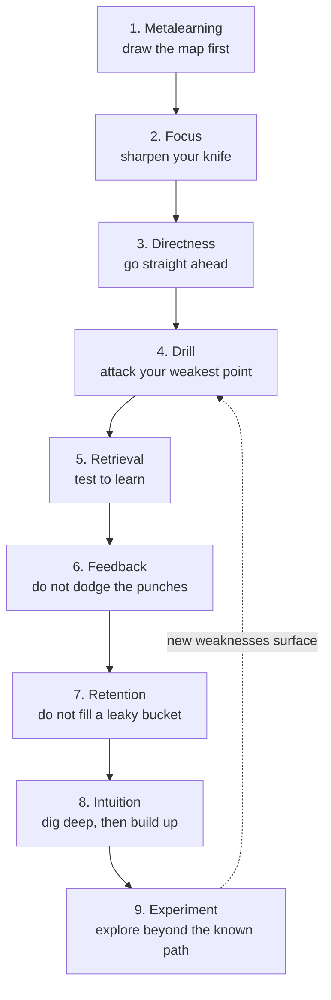
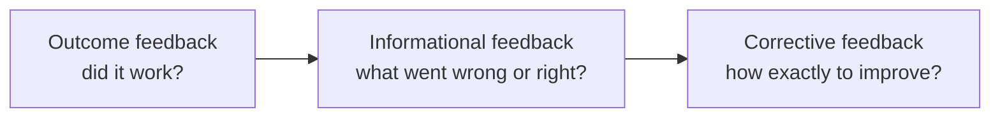

# Ultralearning

**Scott H. Young · HarperCollins · August 6, 2019 · Wall Street Journal bestseller**

*Ultralearning* is the flagship practical guide of the modern self-directed learning movement. Its central promise is blunt: an ordinary person, working alone and without tuition, can acquire genuinely hard skills — programming, languages, public speaking, drawing — far faster than conventional schooling assumes, provided the learning is **self-directed** (you choose the project, the methods, and the standards) and **intense** (you push against the edge of your ability rather than coasting). The book packages this claim into nine named principles, illustrated by the author's own audacious experiments and by historical figures who taught themselves difficult things. This note explains the argument, walks through all nine principles, weighs the evidence for and against them, and situates the book among its neighbors in the learning-science shelf.

## Why This Book Exists: The Central Question

Every reader arrives at this book carrying an assumption absorbed from years of classroom life: that learning is something done *to* you by institutions — teachers set the pace, curricula set the sequence, grades set the standard. Young's governing question attacks that assumption directly. If the world's knowledge is now largely free online, and if decades of cognitive science have identified which practice conditions actually produce durable skill, why do most people still learn slowly, passively, and with poor retention?

His answer is that people rerun the routines they picked up as students — rereading notes, highlighting, cramming — because those routines feel like learning even though they underperform it. *Ultralearning* exists to break those mental ruts. The thesis has three parts:

1. **Intense, self-directed projects are a legitimate alternative path** to expensive formal credentials for many skills, not a fringe hobby for geniuses.
2. **The difference between slow and fast learners is mostly method, not talent** — the fast ones arrange practice so that it is direct, effortful, and feedback-rich.
3. **In an economy of rapid technological change, the meta-skill of learning hard things quickly is itself the career asset**, more durable than any single credential.

The publisher's framing stresses the economic stakes: continual self-education as insurance against obsolescence. But the deeper current in the book is closer to what reviewers like the Lifehack interview emphasize — Young treats learning as central to living well, a broadening of horizons rather than merely a career hedge. Both motivations coexist in the text, and the book explicitly encourages blending practical reasons with genuine fascination — a theme Ian Leslie develops fully in [[Curious|Curious]], which argues that sustained curiosity is itself a trainable disposition rather than a fixed trait.

## The Author Behind the Method

Scott H. Young is a Canadian writer and entrepreneur who has been blogging about learning, productivity, and habits since 2006, and who sells online courses on learning and career improvement (including Rapid Learner and Top Performer). He is best known for two self-experiments that function as the book's proof of concept:

- **The MIT Challenge (2011–2012).** Young attempted to work through the equivalent of the Massachusetts Institute of Technology's (MIT) four-year undergraduate computer science curriculum in twelve months, using MIT's freely available open-courseware lectures plus self-designed exercises, for a total cost he reports as under two thousand dollars. By his own account, he completed the coursework and passed the same final examinations that MIT students take at the end of their degree programs. His TEDx talk describing the project has been viewed hundreds of thousands of times.
- **The Year Without English.** Together with a friend, he spent a year traveling while deliberately avoiding English in order to learn four languages in twelve months through immersion. Later mini-projects included learning to draw recognizable portraits in thirty days.

He is a graduate of the University of Manitoba and of Montpellier Business School, which matters for tone: he is not anti-institution, having attended two himself. A biographically important detail surfaced in one critical review: Young began collaborating with Cal Newport — the Georgetown professor and author of deep-work and study-tactics books — back when Newport was still an MIT postdoctoral researcher during the MIT Challenge period. That lineage matters for vault readers, because Newport's [[How-to-Become-a-Straight-A-Student|How to Become a Straight-A Student]] is essentially the *institutional, tactical* sibling of Young's *self-directed, strategic* program. The two books share a DNA of ruthless efficiency and evidence-minded practice design.

## What Counts as Ultralearning — and What Does Not

Young defines ultralearning as a strategy for acquiring skills and knowledge that is both **self-directed** and **intense**. Unpacking that definition reveals the boundaries of the concept:

- **Self-directed** means the learner chooses the project, researches how the subject is learned, selects methods, sets standards, and evaluates progress. It does not mean learning in isolation — hiring coaches, joining communities, and getting tutors are all compatible, as long as the learner remains the decision-maker.
- **Intense** means the practice is concentrated and uncomfortable by design. Ultralearners compress learning into demanding sprints, seek out difficulty, and expose themselves to evaluation. Comfortable, passive exposure — watching lectures indefinitely, reading without recall — is precisely what the term excludes.
- **Project-shaped.** Ultralearning typically takes the form of a bounded project with a defined target: hold a conversation in a new language, ship a working piece of software, give a competent speech. Projects create the pressure and the feedback loops that diffuse "studying" lacks.

Three clarifications prevent common misreadings. First, ultralearning is **not a hack culture**: Young repeatedly rejects tricks and shortcuts in favor of deeper processing, and his Intuition principle explicitly warns against memorization gimmicks. Second, it is **not anti-school**: Young acknowledges that universities provide mentorship, networks, friendships, and credentials that self-study cannot fully replicate; his claim is narrower — that for the *skill-acquisition component* of education, self-directed projects can be faster and cheaper, and that institutions are often locked into slower traditional formats. Third, it is **not all-or-nothing**: the book sketches lighter ways in — part-time projects alongside a job, learning sabbaticals, or simply retrofitting the principles into existing studies.

## The Architecture of the Book: Nine Principles

The heart of the book is a framework of nine principles, each given its own chapter with a memorable tagline. They are not a rigid sequence so much as a toolkit arranged along the life cycle of a learning project: research the territory, sustain effort, practice in ways that transfer, fix weaknesses, consolidate memory, build understanding, and eventually transcend borrowed methods.

Audio description: This diagram shows the nine principles of ultralearning arranged as a journey. It begins with Metalearning, researching how the subject works before diving in. Next comes Focus, building the ability to concentrate. Then Directness, practicing the actual target skill. From there the loop tightens: Drill isolates weak subskills, Retrieval tests memory before confidence arrives, and Feedback brings in outside correction. The final three principles consolidate and extend the gains — Retention protects memory over time, Intuition builds deep understanding, and Experimentation pushes past other people's templates. A dashed arrow loops from Experiment back to Drill, indicating that mastery is cyclical: pushing into new territory exposes fresh weaknesses, restarting the drill-test-feedback cycle.

The table below condenses each principle into its core move, representative tactics the book describes, and the nearest body of learning science behind it. Read it as a map; the subsections afterward explain each row in depth.

| Principle | Core move | Representative tactics | Nearest research tradition |
|---|---|---|---|
| Metalearning | Research how the subject is structured and learned | Expert interviews, benchmarking curricula, emphasize/exclude analysis | Metacognition, transfer research |
| Focus | Build sustained, distraction-free concentration | Five-minute rule, Pomodoro bursts, timeboxing, environment design | Attention and procrastination research |
| Directness | Practice the target activity itself | Project-based learning, immersion, flight-simulator method, overkill | Transfer-appropriate processing |
| Drill | Isolate and attack the weakest component | Time slicing, cognitive components, copycat method, magnifying glass, prerequisite chaining | Deliberate practice, componential training |
| Retrieval | Recall information rather than review it | Flashcards, free recall, question-based notes, closed-book practice | Testing effect |
| Feedback | Seek signal, tolerate discomfort | Outcome, informational, and corrective feedback ladders | Feedback-intervention research |
| Retention | Fight forgetting systematically | Spacing, proceduralization, overlearning, mnemonics | Spacing effect, memory consolidation |
| Intuition | Understand deeply enough to generate answers | Feynman-style explanation, deriving rules, worked-example study | Expertise and schema research |
| Experiment | Transcend borrowed methods | Copy-then-modify, side-by-side method comparison, constraints, hybrids | Creative expertise, exploration/exploitation |

Audio description: The table lists the nine principles in order. For each one it gives the core move in a phrase, several named tactics the book teaches, and the closest scientific research tradition supporting it. For example, the Retrieval row pairs the move "recall information rather than review it" with tactics like flashcards and free recall, grounded in the testing-effect literature. The table is a navigational aid; the detailed explanations follow in the text.

### 1. Metalearning: Draw the Map First

Before investing serious hours, the ultralearner studies the subject *as a subject*: how experts structure it, what resources exist, where beginners typically stall. Young recommends spending roughly ten percent of the total expected learning time on this research phase — a few hours for a month-long project, proportionally more for a year-long one. Three questions organize the survey. **Why** are you learning this (career utility, curiosity, or both)? **What** is the material made of — concepts (things you must understand), facts (things you must memorize), and procedures (things you must practice until automatic)? **How** will you actually study — which books, courses, communities, and mentors?

Two named methods make this concrete. The **expert interview method** means finding someone slightly ahead of you and asking how they would learn the skill today, which surfaces non-obvious sequencing and dead ends. **Benchmarking** means examining how standard curricula and successful self-learners structured the same material, then adapting rather than copying. Finally, the **emphasize/exclude method** trims the map to your purpose: a programmer learning French for business needs different emphases than one aiming for literary fluency.

This principle is the book's most distinctive contribution relative to generic study guides, and it connects directly to the metacognition literature — see [[Thinking-About-Thinking|Thinking About Thinking]] for a fuller treatment of monitoring and controlling one's own cognition. Metalearning converts learning from an improvised slog into a designed project.

### 2. Focus: Sharpen Your Knife

Intensity is impossible without concentration, so the second principle treats focus as a trainable capacity rather than a personality trait. Young diagnoses three failure modes. **Procrastination** is framed as an emotional-regulation problem: we flee tasks that trigger discomfort, and the urge peaks at the start. His countermeasure is the five-minute rule — commit to just five minutes, long enough for the initial aversion crest to pass. **Distraction** comes from environment (phones, notifications), from the task itself (multitasking between materials), and from the mind (daydreaming, anxiety); each demands a different fix, from physical environment design to noting intrusive thoughts and returning. **Poor session design** wastes whatever focus exists: the book favors sessions of roughly fifty to sixty minutes, spaced across days rather than crammed, with tools like the Pomodoro technique (twenty-five-minute focused bursts followed by short breaks) and timeboxing (pre-committed calendar blocks) as scaffolding for people building the habit.

Readers coming from [[A-Mind-for-Numbers|A Mind for Numbers]] will recognize the family resemblance: Barbara Oakley's focused-mode versus diffuse-mode distinction makes the same core point that deep learning alternates between intense concentration and rest, and that beginners systematically underestimate how much uninterrupted attention new material demands.

### 3. Directness: Go Straight Ahead

This is the book's sharpest edge and its most important idea. Directness means tying practice tightly to the context where the skill will actually be used: if you want to speak French, speak French from week one; if you want to build software, build software. Young argues that much formal education fails not because it teaches the wrong content but because it trains skills in a *transfer-hostile* format — students become excellent at textbook problems and lecture-recognition while remaining unable to perform the real-world activity those problems were supposed to represent. The mismatch between how we practice and where we perform is, in his telling, the single biggest hidden tax on learning.

When the real environment is inaccessible, the book offers graded substitutes. **Project-based learning** wraps study inside a concrete artifact — build the website, paint the portrait, ship the game. **Immersion** relocates you into the performance environment, as with living abroad for language. The **flight-simulator method** builds realistic simulation when reality is dangerous or expensive. The **overkill approach** deliberately raises stakes above the target level — entering competitions, publishing publicly — so the real environment feels easy by comparison. This principle is the popular bridge to Anders Ericsson's deliberate-practice research; [[Peak|Peak]] provides the underlying science of how experts structure practice, and Young extends it from supervised domains like music and chess to self-designed projects.

### 4. Drill: Attack Your Weakest Point

Direct practice exposes bottlenecks — the specific sub-skills that cap overall performance, like a chord change that breaks a song or a data-structure gap that stalls every coding problem. Drilling isolates those components, trains them intensively, then reintegrates them into whole-task practice. Young is careful about the cycle's direction: drill *after* direct practice identifies the weakness, not instead of realistic practice. The book catalogs several isolation tactics: **time slicing** (repeatedly practicing one brutal segment, as a musician isolates eight bars), **cognitive components** (isolating one mental step, such as memorizing vocabulary separately from conversation), the **copycat method** (copying the easy parts so the hard part can be practiced alone), the **magnifying glass method** (spending disproportionate time on the weakest area), and **prerequisite chaining** (learning a missing foundation mid-project, then returning).

The logic here descends straight from deliberate practice: improvement lives at the edge of ability, and whole-task performance alone rarely keeps you at that edge. [[Peak|Peak]] again supplies the research backbone; Young's contribution is showing how a solo learner can manufacture the isolate-train-reintegrate cycle without a coach designing drills for them.

### 5. Retrieval: Test to Learn

The fifth principle weaponizes one of the most replicated findings in cognitive psychology: attempting to retrieve information strengthens memory far more than reviewing it. Young's directive is to test yourself *before* you feel ready, because the struggle of near-failed recall is precisely what builds durable traces. The tactic menu is generous: **flashcards** for atomic facts; **free recall** (after reading, write down everything you remember, then check); **question-based notes** (convert notes into questions the moment you take them); **self-generated challenges** (invent problems for yourself and solve them); **closed-book practice** (produce work without references, then open the book to correct); and **forward-testing** (using early tests to prime later learning). The shared mechanism is desirable difficulty — conditions that feel harder in the moment but produce stronger learning.

Vault readers should read this chapter alongside [[Make-It-Stick|Make It Stick]], where Brown, Roediger, and McDaniel present the laboratory case for retrieval practice, spacing, and interleaving in depth. Young's Retrieval principle is essentially the project-management implementation of that science.

### 6. Feedback: Do Not Dodge the Punches

Feedback accelerates learning, but only if the learner can metabolize it, and most people's egos are organized to avoid exactly the feedback that helps. Young sorts feedback into a rising ladder of value. **Outcome feedback** tells you only whether you succeeded — a grade, a win or loss — which is motivating but informationally thin. **Informational feedback** tells you *what* went wrong or right but not necessarily why. **Corrective feedback** — the rarest and most valuable — tells you what to do differently and how, usually requiring a mentor, expert community, or rigorous external standard. The strategic advice follows directly: engineer situations that climb the ladder, and cultivate the psychological tolerance to seek harsh evaluators rather than comfortable applause.

Audio description: This diagram shows feedback as a three-rung ladder of increasing usefulness. The first rung, outcome feedback, tells you only whether you succeeded or failed. The second rung, informational feedback, tells you what specifically went wrong or right. The third and highest rung, corrective feedback, tells you exactly how to change your approach. The arrows show progression upward, and the accompanying text explains that higher rungs are harder to obtain but far more valuable for improvement.

The psychological precondition here is a growth-oriented self-concept: if ability feels fixed, every critique threatens identity, and learners retreat to safe feedback. Carol Dweck's research, summarized in [[Mindset|Mindset]], supplies the supporting science — Young's insistence on putting ego aside is mindset theory translated into learning-project logistics.

### 7. Retention: Do Not Fill a Leaky Bucket

Skills decay, and ultralearning's compressed timelines make decay obvious. Young's solutions map onto the memory literature. **Spacing** distributes practice over time rather than massing it, exploiting the spacing effect. **Proceduralization** converts declarative knowledge into automatic routines — typing, grammar patterns, code idioms — that resist forgetting because they run as procedures rather than facts. **Overlearning** means continuing to practice past bare competence so the skill becomes robust under stress. **Mnemonics** earn a qualified endorsement: useful for arbitrary mappings (vocabulary, anatomy, character sets), unnecessary for deeply understood material. Benedict Carey's [[How-We-Learn|How We Learn]] covers the same consolidation science — sleep, forgetting as a filter, the spacing effect — from a journalist's vantage, and pairs naturally with this chapter.

### 8. Intuition: Dig Deep Before You Build Up

Fast learners, Young argues, are distinguished less by memory than by the quality of their mental models. The Intuition principle pushes against shortcut culture: rather than memorizing formulas, derive them; rather than accepting rules, ask what problem the rule solves. The chapter leans heavily on the physicist Richard Feynman, whose famous habit was to rebuild ideas from first principles and test understanding by explaining them plainly — the practice later popularized as the Feynman technique. Tactics include studying the derivations behind rules, collecting concrete examples before abstractions, asking naive questions experts have stopped asking, and using play and exploration to build a felt sense of the domain. The goal is a mind that can generate answers to questions it has never seen, which is what separates understanding from trivia.

### 9. Experiment: Explore Outside Your Comfort Zone

The final principle addresses mastery's plateau. Past a certain point, following other people's paths stops producing growth, because the paths were built for different goals and different minds. Young proposes treating your own methods as hypotheses: **copy, then modify** (start by imitating masters, then diverge deliberately); **compare methods side by side** (run two approaches concurrently and measure); **introduce constraints** (limiting resources forces creative variation); and **hybridize** (combine skills from unrelated fields into something nobody else offers). Experimentation reframes the learner as a scientist of their own practice — which closes the loop back to Metalearning, since experimental results feed the next project's map.

## The Case Studies That Carry the Argument

The book's persuasive engine is narrative. Alongside his own projects, Young profiles figures spanning centuries:

- **Benjamin Franklin** serves as the patron saint of deliberate self-improvement. The book recounts how Franklin, wanting to write well, took apart essays from a magazine he admired, reduced them to notes, reconstructed them from the notes, and compared his versions against the originals to expose gaps in vocabulary, argument, and structure — a homemade drill-and-feedback system centuries before the terminology existed.
- **Judit Polgár**, the chess grandmaster, illustrates engineered intensity: raised in a family whose father deliberately designed an intensive chess-centered upbringing, she demonstrates how early, immersive, competitive practice can produce world-class expertise — and how competition supplies relentless corrective feedback.
- **Richard Feynman**, the Nobel laureate physicist, anchors the Intuition principle, embodying the rebuild-from-first-principles style of understanding described above.
- **Nigel Richards** provides the book's most startling anecdote: a New Zealander who won the French-language World Scrabble Championship despite, by the book's telling, not speaking French — having instead mastered French Scrabble vocabulary as a pattern-recognition problem. The story doubles as a lesson in defining what a skill actually consists of before training it.

These stories do real rhetorical work: they normalize autodidactic ambition, show the principles operating across eras and domains, and make the abstraction of "direct, intense practice" vivid. They also, as critics note, carry evidentiary risks discussed below.

## The Scientific Footing: What Supports the Principles

It is worth separating three layers of support for the book's claims, because they differ sharply in strength.

**Layer one: well-established laboratory findings.** Several principles sit squarely on robust, replicated results from cognitive psychology. The testing effect behind Retrieval, the spacing effect behind Retention, the value of interleaving and varied practice, the superiority of focused sessions over multitasking, and the importance of effortful, specific feedback are all mainstream conclusions, documented extensively in sources like [[Make-It-Stick|Make It Stick]]. To the extent Ultralearning prescribes retrieval, spacing, and feedback-rich direct practice, it is prescribing consensus science.

**Layer two: expertise research extended to self-design.** The Drill and Directness principles adapt Ericsson's deliberate-practice framework — effortful practice at the edge of ability, immediate informative feedback, targeting weaknesses — from domains with teachers and traditions (violin, chess, sports) to self-organized projects. This extension is plausible and partly supported, but the extension itself is Young's construction; the original research studied coached, institutionalized practice, so applying it to solo learners involves inference, not citation.

**Layer three: the aggregate claim.** The boldest assertion — that self-directed intense projects can rival or beat formal education in speed and cost for suitable skills — rests primarily on demonstration cases: Young's MIT Challenge, the language year, and profiles like Richards. These are existence proofs, not controlled comparisons. No randomized trial assigns learners to ultralearning versus conventional instruction and measures outcomes; the book does not pretend otherwise, but promotional framing sometimes blurs the line between "this worked spectacularly for a few motivated people" and "this will work for you."

That layering matters for honest reading. The tactical core of the book is on solid ground; the strategic promise is best treated as a strong hypothesis supported by vivid cases, conditional on the learner possessing unusual drive, time, and tolerance for discomfort.

## Strengths and Major Contributions

Several achievements distinguish this book within the crowded learning-skills genre.

**First, it integrates scattered science into an end-to-end project architecture.** Most evidence-based learning books stop at techniques — flashcards, spacing schedules — leaving readers to figure out how to assemble them into an actual campaign. Ultralearning supplies the missing scaffolding: research the domain, design the project, choose direct practice, drill bottlenecks, test relentlessly, harvest feedback, protect retention, deepen intuition, then experiment. That systems-level view is the book's clearest original contribution.

**Second, it takes the transfer problem seriously.** Few popular books name the gap between practicing in a study context and performing in a real one, and fewer still offer a graded toolkit (projects, immersion, simulation, overkill) for closing it. Directness alone justifies the book's place on the shelf beside [[Peak|Peak]] and [[Make-It-Stick|Make It Stick]].

**Third, Metalearning legitimizes preparation as learning.** Treating "how is this subject learned?" as a researchable question worth ten percent of total effort is a genuinely useful reframe, and it connects the book to the metacognitive tradition represented in this vault by [[Thinking-About-Thinking|Thinking About Thinking]].

**Fourth, the case studies make the science memorable.** Franklin's essay reconstruction and Richards's French Scrabble victory function as mnemonics for the principles themselves — readers forget arguments but retain stories, and Young exploits that.

**Fifth, it is honest about cost.** Unlike hack-culture productivity books, Ultralearning frames intensity as the price of admission, not an inconvenience to be optimized away. That honesty builds trust and filters expectations.

**Sixth, its cultural role is significant.** Within this vault's curriculum, the book functions as the applied synthesis node: the research-focused notes — [[Make-It-Stick|Make It Stick]], [[Peak|Peak]], [[How-We-Learn|How We Learn]], [[A-Mind-for-Numbers|A Mind for Numbers]] — establish *what works*, while Ultralearning establishes *how to organize a life around it*. Correspondingly, multiple notes across the vault link back here — including [[Make-It-Stick|Make It Stick]], [[Peak|Peak]], [[Range|Range]], [[Drive|Drive]], [[Grit|Grit]], and [[Mindset|Mindset]] — treating it as the project-level destination where their findings get deployed. That inbound traffic is itself evidence of the book's load-bearing position in the curriculum.

## Criticisms, Limitations and Counterarguments

A fair assessment must weigh the objections seriously; several recur across independent reviewers.

**Anecdote-driven evidence and survivorship bias.** The case-study method showcases winners. For every self-taught programmer who passes MIT finals, an unknown number of self-learners quietly stalled, burned out, or overestimated their competence — and their stories are absent by construction. Famous successes like Feynman and Franklin are doubly unrepresentative, being extraordinary talents whose methods may not generalize. Reviewers have noted that the book leans on personal testimony and inspiring anecdotes where systematic outcome data would be needed to establish that ultralearning *beats alternatives*, rather than merely that it sometimes works.

**Feasibility and the time-wealth assumption.** The exemplar projects assume large discretionary time budgets, financial slack, and often geographic freedom (a year abroad for languages). Readers juggling jobs, caregiving, or precarious finances receive limited guidance on scaled-down versions. The intensity framing can inadvertently shame part-time learners, even though the principles themselves scale down gracefully.

**One-size-fits-all tendencies.** Critics argue the framework underweights individual differences — prior knowledge, working-memory constraints, neurodivergence, domain-specific structure. A beginner in mathematics and a beginner in public speaking face very different failure modes, and the book's uniform nine-principle presentation can obscure that. Relatedly, the motivational engine assumed — intrinsic drive plus career fear — will not fire identically for everyone; readers of [[Drive|Drive]] will recognize that autonomy fuels motivation mainly when competence and purpose are also present.

**Undervaluing social and collaborative learning.** The archetype is the lone autodidact, and while Young permits coaches and communities, the rhetoric privileges solitary grind. Yet much expertise is socially scaffolded: apprenticeship, peer critique, team practice, and the accountability structures of classrooms contribute motivation and calibration that solo projects must labor to replicate. Institutional defenders can point to [[What-the-Best-College-Teachers-Do|What the Best College Teachers Do]] for evidence that excellent teaching produces deep approaches to learning that self-study often misses — and to Neil Postman's [[The-End-of-Education|The End of Education]] for the deeper argument that schools exist to transmit shared narratives and purposes, functions no individual project can replace.

**Credential and measurement caveats.** "Equivalent to an MIT degree" claims rest on proxy measures — passing the same final exams — which capture examination performance but not the full package of a university program: laboratory work, collaborative projects, faculty mentorship, peer networks, and the credential's signaling value in labor markets. Young acknowledges some of this, but headline framing can outrun the nuance.

**Tension with breadth-first development.** David Epstein's [[Range|Range]] argues that many high performers benefit from broad sampling, delayed specialization, and analogical cross-pollination — almost a mirror image of ultralearning's narrow, intense, early-commitment projects. The two books are best read as scoped differently (Epstein describes career-shape; Young describes individual projects), but a reader following Ultralearning exclusively could over-specialize prematurely. Holding both in view is the wiser posture.

**Burnout and opportunity cost.** Compressed intensity trades time for strain. Multi-month sprints at the edge of ability carry real psychological costs, and the book's enthusiasm can understate the case for sustainable pacing — a concern adjacent to Angela Duckworth's [[Grit|Grit]] research, which emphasizes sustained passion over episodic heroics.

None of these objections demolishes the framework; they bound it. The strongest defense is modularity — a reader can adopt Retrieval and Directness without attempting a year-long odyssey — and the strongest concession is that the book's evidence is strongest at the tactic level and thinnest at the lifestyle level.

## Evidence Quality Assessment

Grading the book's evidentiary layers explicitly:

- **High confidence:** the value of retrieval practice, spaced repetition, focused sessions, and corrective feedback; the general superiority of direct practice over passive consumption for transfer. These reflect mature literatures.
- **Moderate confidence:** the effectiveness of the specific named tactics (free recall, question-based notes, magnifying-glass drilling) as implementations of those principles; the claim that metalearning research meaningfully improves project outcomes. Plausible, mechanistically sound, but not individually trial-tested at scale.
- **Lower confidence:** the aggregate promise that self-directed projects can substitute for formal education across wide domains; the generalizability of celebrity case studies; implicit claims about optimal session lengths and research-time percentages, which are experienced judgment dressed in numbers.

Readers should also calibrate against the genre. Compared with rigorously sourced syntheses like [[Make-It-Stick|Make It Stick]], Ultralearning is lighter on citations and heavier on narrative; compared with pop-peptide offerings like [[Limitless|Limitless]], it is markedly more disciplined, anchoring every principle in real cognitive science rather than myth. Its evidentiary home is the solid middle of the popular-science spectrum: honest about mechanisms, loose about statistics.

## Applying the Ideas: Designing Your First Project

Because this is a practical guide, the fairest test is operational. A minimal protocol distilled from the book:

1. **Pick a bounded target with a performance test attached** — a conversation with a native speaker, a shipped application, a delivered speech. Vague aspirations ("get better at Spanish") defeat every downstream principle.
2. **Budget roughly ten percent of expected total time for metalearning:** interview someone ahead of you, benchmark how others learned it, list the concepts, facts, and procedures involved, and cut anything your purpose does not need.
3. **Schedule direct practice first.** Put the real activity on the calendar before any preparatory study, and let study fill the gaps the activity exposes.
4. **Instrument the project for feedback:** find the harshest available evaluator — a community, a coach, a competition, public posting — and climb from outcome toward corrective feedback.
5. **Run weekly retrieval checks** (closed-book production, free recall, self-generated challenges) and log what fails; convert repeated failures into drills.
6. **Protect retention with spacing** from day one, and schedule deliberate overlearning of mission-critical sub-skills.
7. **Close with an experiment:** change one variable in your method, compare results, and feed conclusions into the next project's map.

Learners wanting a parallel, institution-flavored toolkit for coursework can pair this with [[The-Study-Skills-Handbook|The Study Skills Handbook]], which covers similar ground from the formal-education side; the two together cover both self-designed projects and embedded academic study.

## Five Things to Remember

1. Ultralearning means learning that is self-directed and intense: you own the project's goals, methods, and standards, and you deliberately practice at the edge of discomfort.
2. Begin with metalearning — invest about a tenth of the total effort researching how the subject is structured and learned before diving in.
3. Practice directly: tie training to the real performance context, and treat lectures and books as support for doing, not substitutes for it.
4. Test before you feel ready and hunt corrective feedback; retrieval and honest critique build skill faster than comfortable review ever will.
5. Speed comes from eliminating waste — misdirected practice, passive review, leaky retention — not from shortcuts; spacing, drilling, and deep understanding are what make fast learning durable.

## Related Books

- [[Make-It-Stick|Make It Stick]] — *Agreement and scientific foundation.* Brown, Roediger, and McDaniel supply the laboratory evidence — retrieval practice, spacing, interleaving — that underlies Young's Retrieval and Retention principles; read it for the science, Ultralearning for the project design.
- [[A-Mind-for-Numbers|A Mind for Numbers]] — *Complementary angle.* Oakley's focused-versus-diffuse modes and chunking give a novice-friendly account of the attention mechanics behind Focus and Drill, specialized to math and science.
- [[Peak|Peak]] — *Extension.* Ericsson and Pool document deliberate practice in coached domains; Young extends that framework to self-organized projects, which is precisely the gap Ultralearning fills.
- [[Range|Range]] — *Productive tension.* Epstein's case for broad sampling and delayed specialization cuts against ultralearning's narrow intensity; holding both prevents premature over-specialization.
- [[How-We-Learn|How We Learn]] — *Complementary angle.* Carey's tour of forgetting, sleep, and incubation enriches the Retention and Intuition principles with a science-journalist's breadth.
- [[Limitless|Limitless]] — *Contrast in rigor.* Kwik shares the empowerment framing but with far weaker evidentiary discipline; useful as a calibration point for what popular learning books owe their readers.
- [[How-to-Become-a-Straight-A-Student|How to Become a Straight-A Student]] — *Companion from the same lineage.* Newport's tactical playbook serves institutional students as Ultralearning serves self-directed ones; the authors have collaborated since Young's MIT Challenge era.
- [[Thinking-About-Thinking|Thinking About Thinking]] — *Deepening.* Hollins's treatment of metacognition expands the Metalearning principle into a full account of self-monitoring and self-regulation.
- [[The-Study-Skills-Handbook|The Study Skills Handbook]] — *Institutional mirror.* Cottrell's handbook packages study strategies for formal coursework; read together, the two show how the same principles flex between self-designed projects and embedded academic programs.
- [[Curious|Curious]] — *Motivational fuel.* Leslie argues that curiosity is a disposition that can be cultivated through diverse inputs and questioning habits; it explains where the sustained drive ultralearning demands actually comes from.
- [[Drive|Drive]] — *Motivation science.* Pink's autonomy-mastery-purpose framework explains why self-directed projects are so motivating — and why the career-fear framing alone would be insufficient.
- [[Grit|Grit]] — *Sustainability check.* Duckworth's research on long-horizon passion and perseverance tempers ultralearning's sprint mentality with evidence that enduring commitment beats episodic heroics.
- [[Mindset|Mindset]] — *Psychological precondition.* Dweck's growth-mindset research underwrites the Feedback principle: learners who believe ability is malleable seek criticism instead of fleeing it.
- [[What-the-Best-College-Teachers-Do|What the Best College Teachers Do]] — *Institutional counterweight.* Bain shows what excellent teaching achieves that solo projects struggle to replicate, grounding the criticism that ultralearning undervalues social scaffolding.
- [[The-End-of-Education|The End of Education]] — *Philosophical backdrop.* Postman's argument that education transmits shared purposes and narratives frames the limits of treating learning purely as private skill acquisition.

## TTS-Friendly Recap

Ultralearning is a book by Scott Young about learning difficult skills quickly on your own terms. The core idea is simple to state. If you choose your own learning project, and if you push yourself to practice intensely at the edge of your ability, you can acquire hard skills far faster than traditional schooling assumes. Young proved this to himself by attempting to complete the equivalent of a four-year computer science degree from M.I.T. in just twelve months, using free online lectures and passing the same final exams as regular students. He also spent a year traveling while refusing to speak English, in order to learn four languages through total immersion.

The book organizes its advice into nine principles. First, metalearning: before you start, spend some time researching how the subject is actually structured and learned. Second, focus: train your concentration and remove distractions, because intensity is impossible without attention. Third, directness: practice the real skill in the real context, rather than practicing convenient substitutes that fail to transfer. Fourth, drill: find your weakest sub-skill and attack it in isolation, then put it back into whole-task practice. Fifth, retrieval: test yourself before you feel ready, because struggling to recall builds stronger memories than rereading ever will. Sixth, feedback: actively seek correction, especially the rare kind that tells you exactly how to improve, and learn to tolerate the discomfort it brings. Seventh, retention: fight forgetting with spaced practice, overlearning, and turning knowledge into automatic routines. Eighth, intuition: understand ideas deeply enough to rebuild them from first principles, in the style of the physicist Richard Feynman. Ninth, experiment: once you have mastered other people's methods, treat your own approach as a hypothesis and start innovating.

The evidence behind these ideas varies in strength. The advice on testing yourself, spacing your practice, and seeking feedback rests on solid, replicated cognitive science. The bolder claim, that self-directed projects can rival formal education, rests mostly on inspiring stories rather than controlled comparisons, so it should be treated as a strong hypothesis rather than a guarantee. Critics note survivorship bias, the assumption that learners have lots of free time, and the risk of burnout from extreme intensity. Even so, the tactical core of the book is trustworthy, and its biggest gift is architectural: it shows you how to assemble proven techniques into a complete, self-directed learning campaign. Start small, pick a project with a clear performance test, practice the real thing directly, test yourself honestly, and let each finished project feed the map for the next one.

## Sources and Further Reading

- Official author site and blog, including the MIT Challenge write-up: [https://www.scotthyoung.com/blog/](https://www.scotthyoung.com/blog/)
- Scott Young's detailed account of the MIT Challenge project: [https://www.scotthyoung.com/blog/myprojects/mit-challenge-2/](https://www.scotthyoung.com/blog/myprojects/mit-challenge-2/)
- Publisher's catalog page for Ultralearning (Harper Business): [https://www.harpercollins.com/products/ultralearning-scott-h-young](https://www.harpercollins.com/products/ultralearning-scott-h-young)
- Scott Young's TEDx talk on the MIT Challenge: [https://www.youtube.com/watch?v=NNNomBEXOBU](https://www.youtube.com/watch?v=NNNomBEXOBU)
- Roediger and Karpicke, "Test-Enhanced Learning" (the foundational testing-effect paper): [https://doi.org/10.1111/j.1467-9280.2006.01693.x](https://doi.org/10.1111/j.1467-9280.2006.01693.x)
- Cepeda et al., meta-analysis of distributed practice (the spacing effect): [https://doi.org/10.1037/0033-2909.132.3.354](https://doi.org/10.1037/0033-2909.132.3.354)
- Ericsson, Krampe, and Tesch-Römer, "The Role of Deliberate Practice in the Acquisition of Expert Performance": [https://doi.org/10.1037/0033-2909.113.3.486](https://doi.org/10.1037/0033-2909.113.3.486)
- Dunlosky et al., "Improving Students' Learning With Effective Learning Techniques": [https://doi.org/10.1177/1529100612453266](https://doi.org/10.1177/1529100612453266)
- Community reviews and ratings for Ultralearning on Goodreads: [https://www.goodreads.com/book/show/43708132-ultralearning](https://www.goodreads.com/book/show/43708132-ultralearning)

## Navigation

← Previous: [[A-Mind-for-Numbers|A Mind for Numbers]]
↑ Category: [[md/01-Learning-Cognition-and-Meta-Skills/README|Learning, Cognition & Meta-Skills]]
→ Next: [[Peak|Peak]]
