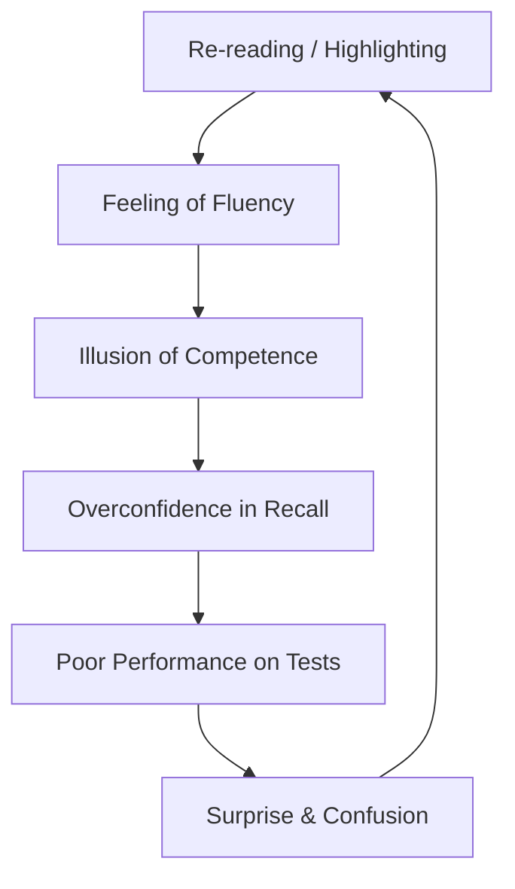

# Make It Stick: The Science of Successful Learning — The Illusion of Knowledge

*By Peter C. Brown; Henry L. Roediger III; Mark A. McDaniel*

## Thematic Deep-Dive

The book opens with a provocative claim: **most of what we believe about learning is wrong.** The authors identify a cluster of "common sense" study strategies that feel productive but are demonstrably ineffective:

1. **Re-reading** — The most common study strategy. It produces *fluency*: the text feels familiar, and the reader feels confident. But fluency is not mastery. Re-reading does not build the neural pathways required for durable recall.

2. **Highlighting and underlining** — These create the *illusion* of engagement. They mark what "seems important" but do not force the brain to retrieve or reconstruct meaning.

3. **Massed practice (cramming)** — Studying the same material in one intense block feels efficient, but it produces rapid forgetting. The "spacing effect"—one of the most robust findings in cognitive psychology—shows that distributed practice produces far stronger long-term retention.

4. **The fluency trap** — When information feels easy to process (fluent), the brain mistakes that ease for mastery. This is the root of the *illusion of competence*.

## Frameworks & Mechanisms

### The Illusion of Competence Loop

The loop is self-reinforcing: the more fluently you process material, the more confident you feel, and the less motivated you are to engage in effortful retrieval—which is precisely what builds durable memory.

### Calibration: The Antidote

Calibration is the process of aligning your *judgment of learning* with your *actual performance*. The authors argue that the only reliable way to calibrate is to **test yourself**—to attempt retrieval without the material in front of you.

> [!IMPORTANT] The Core Insight
> The feeling of knowing is not the same as knowing. Fluency is a poor proxy for mastery. The only reliable way to know what you know is to attempt retrieval under test-like conditions.

## Evidence & Empirical Support

The authors cite the foundational research of **Roediger & Karpicke (2006)**, which demonstrated the *testing effect*: students who studied a passage and then took a practice test retained significantly more than students who re-read the passage multiple times. The effect was especially pronounced on delayed tests (one week later).

> [!NOTE] The Testing Effect
> Retrieving information from memory strengthens the memory trace and makes it more resistant to forgetting. This is one of the most robust findings in cognitive psychology.

## Implementation Protocols

- [ ] Replace re-reading with **self-quizzing** after each study session.
- [ ] Use **closed-book recall**—write down everything you remember before checking your notes.
- [ ] Ask yourself: "Can I explain this concept from memory, without looking?" If not, you haven't learned it yet.
- [ ] **Delay your judgment**—don't trust the feeling of "I know this." Test it.

---

## 🧭 Sequential Reading Navigation
| Previous | Up | Next |
| :--- | :---: | :--- |
| [[README|🏠 Executive Summary & Hub]] | [[README|📑 Table of Contents]] | [[02-Retrieval-Practice-and-Spacing|➡️ Next Chapter]] |
