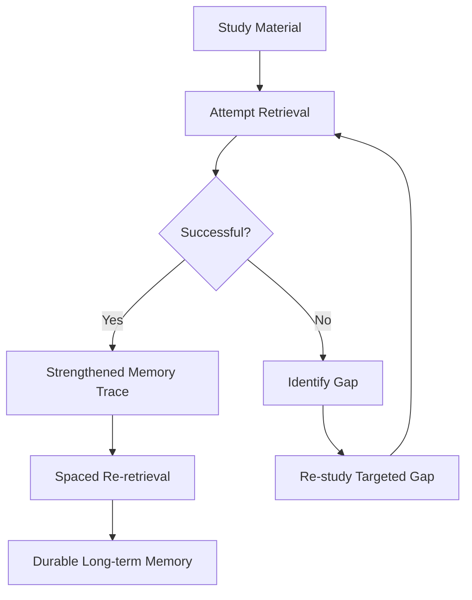

# Make It Stick: The Science of Successful Learning — Retrieval Practice & Spacing

*By Peter C. Brown; Henry L. Roediger III; Mark A. McDaniel*

## Thematic Deep-Dive

This is the heart of the book. The authors present three interlocking techniques that form the core of effective learning:

### 1. Retrieval Practice

Retrieval practice is the act of **recalling information from memory**—not re-reading it, not recognizing it, but *reconstructing* it. Every time you retrieve, you strengthen the memory trace and create additional retrieval pathways.

Key insight: **Retrieval is not a neutral test of learning; it is a learning event in itself.** The act of pulling information out of memory changes the memory, making it more durable and more accessible.

### 2. Spacing

The spacing effect: **distributing study sessions over time produces dramatically better retention than massed practice.** The optimal gap depends on how long you want to retain the material—roughly, the longer the retention interval, the longer the spacing gap should be.

### 3. Interleaving

Interleaving means **mixing different but related topics** during practice, rather than blocking them (studying one topic completely before moving to the next). Interleaving forces the brain to discriminate between similar concepts, which builds the ability to *select the right solution* in real-world contexts.

## Frameworks & Mechanisms

### The Retrieval-Strengthening Loop

### The Spacing Curve

The authors describe the relationship between spacing and retention:

- **Massed practice** (cramming): rapid acquisition, rapid forgetting.
- **Spaced practice**: slower acquisition, dramatically slower forgetting.

The optimal spacing interval grows with the desired retention period. For material you want to retain for years, space practice sessions weeks apart.

> [!TIP] The Spacing Rule of Thumb
> As a general heuristic: the gap between study sessions should be roughly 10–20% of the retention interval you desire. Want to remember for a week? Space sessions a day or two apart. Want to remember for a year? Space sessions weeks apart.

## Evidence & Empirical Support

The authors cite a wide body of research:

- **Roediger & Karpicke (2006)**: Students who took practice tests after reading retained ~50% more than re-readers on a one-week delayed test.
- **Cepeda et al. (2006)**: A meta-analysis of the spacing effect showing that distributed practice reliably outperforms massed practice across hundreds of studies.
- **Interleaving studies**: In one study, students who practiced identifying painting styles with interleaved examples outperformed students who studied blocked examples—even though the interleaved group *felt* they had learned less.

> [!WARNING] The Feeling of Learning Less
> Interleaving and spacing often *feel* less effective than blocking and cramming. Students report lower confidence and less perceived progress. But objective performance tells the opposite story. **Trust the data, not the feeling.**

## Implementation Protocols

- [ ] **Quiz yourself** after every study session—closed book, from memory.
- [ ] **Space your sessions**: use a spaced-repetition schedule (e.g., 1 day, 3 days, 7 days, 21 days).
- [ ] **Interleave topics**: mix related subjects in a single study session rather than blocking them.
- [ ] **Use practice tests** as a primary study tool, not just an assessment tool.
- [ ] **Expect to feel less confident** with these methods—that feeling is a sign they are working.

---

## 🧭 Sequential Reading Navigation
| Previous | Up | Next |
| :--- | :---: | :--- |
| [[01-The-Illusion-of-Knowledge|⬅️ Previous Chapter]] | [[README|📑 Table of Contents]] | [[03-Elaboration-and-Desirable-Difficulties|➡️ Next Chapter]] |
