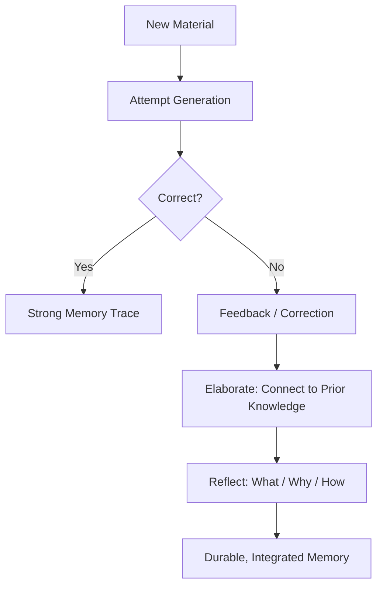

# Make It Stick: The Science of Successful Learning — Elaboration & Desirable Difficulties

*By Peter C. Brown; Henry L. Roediger III; Mark A. McDaniel*

## Thematic Deep-Dive

This chapter explores the concept of **desirable difficulties**—a term coined by cognitive psychologist Robert Bjork—and the related techniques of elaboration, generation, and reflection.

### Desirable Difficulties

Not all difficulties are created equal. Some difficulties are *desirable*: they slow initial learning but produce dramatically stronger long-term retention. Others are *undesirable*: they add friction without benefit.

Desirable difficulties include:

- **Spacing** (covered in the previous chapter)
- **Interleaving** (covered in the previous chapter)
- **Generation** — attempting to solve a problem or answer a question *before* being shown the solution
- **Elaboration** — explaining a concept in your own words, connecting it to prior knowledge, and generating examples

### Generation

The generation effect: **producing an answer yourself—even if you get it wrong—creates a stronger memory trace than being given the answer.** The act of attempting to generate forces the brain to search its memory, and that search itself strengthens the relevant pathways.

### Elaboration

Elaboration is the process of **connecting new information to what you already know.** This can take many forms:

- Explaining a concept in your own words
- Generating concrete examples
- Drawing analogies to familiar domains
- Asking "why" and "how" questions about the material

### Reflection

Reflection is a structured form of elaboration: **reviewing what you learned, what it connects to, and how you might apply it.** The authors describe reflection as a form of retrieval practice combined with elaboration.

## Frameworks & Mechanisms

### The Desirable Difficulty Spectrum

| Type of Difficulty | Effect on Initial Learning | Effect on Long-term Retention | Desirable? |
| :--- | :--- | :--- | :--- |
| Massed practice | Fast | Poor | ❌ No |
| Re-reading | Fast | Poor | ❌ No |
| Spacing | Slow | Excellent | ✅ Yes |
| Interleaving | Slow | Excellent | ✅ Yes |
| Generation | Slow | Excellent | ✅ Yes |
| Elaboration | Slow | Excellent | ✅ Yes |

### The Generation-Elaboration Loop

## Evidence & Empirical Support

The authors cite research on the **generation effect** (Slamecka & Graf, 1978) showing that self-generated information is remembered better than read information. They also discuss **elaboration** research showing that deeper processing—connecting new material to existing knowledge—produces stronger memory traces than shallow processing.

> [!QUOTE] The Core Principle
> "The more effort you expend to retrieve a memory, the stronger the memory becomes." — The authors' synthesis of retrieval research

## Implementation Protocols

- [ ] **Try before you're told**: attempt to solve problems or answer questions before looking at the solution.
- [ ] **Explain it in your own words**: after studying a concept, write or say a one-paragraph explanation without looking.
- [ ] **Generate examples**: for every abstract concept, create at least one concrete example from your own experience.
- [ ] **Ask "why" and "how"**: interrogate the material—why does this work? How does it connect to what I already know?
- [ ] **Reflect daily**: at the end of each day, write down what you learned, what surprised you, and how you'll use it.

## 🧠 Active Recall & Key Takeaways

> [!QUESTION]- What is the "generation effect"?
> The finding that producing an answer yourself—even if you get it wrong—creates a stronger memory trace than being given the answer. The act of attempting to generate forces the brain to search its memory, strengthening the relevant pathways.

> [!QUESTION]- What makes a difficulty "desirable"?
> A difficulty is desirable if it slows initial learning but improves long-term retention. Spacing, interleaving, generation, and elaboration are desirable difficulties. Massed practice and re-reading are not—they feel easy but produce weak retention.

> [!QUESTION]- How does elaboration strengthen memory?
> Elaboration connects new information to existing knowledge, creating multiple retrieval pathways. When you explain a concept in your own words or generate examples, you build a richer network of associations that makes the memory more accessible.

---

## 🧭 Sequential Reading Navigation
| Previous | Up | Next |
| :--- | :---: | :--- |
| [[02-Retrieval-Practice-and-Spacing|⬅️ Previous Chapter]] | [[README|📑 Table of Contents]] | [[04-Mindsets-and-Implementation|➡️ Next Chapter]] |
