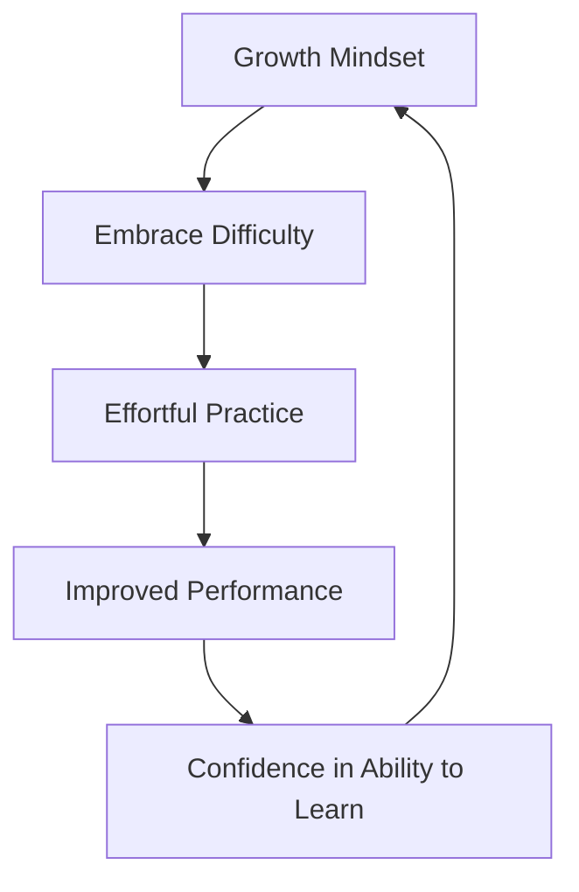

# Make It Stick: The Science of Successful Learning — Mindsets & Implementation

*By Peter C. Brown; Henry L. Roediger III; Mark A. McDaniel*

## Thematic Deep-Dive

The final chapters of the book address the **beliefs and mindsets** that support effective learning, and provide a practical playbook for implementation.

### Beyond Learning Styles

The authors debunk the popular notion of "learning styles" (visual, auditory, kinesthetic). The evidence does not support the claim that matching instruction to a preferred style improves learning. Instead, the authors argue that **the most effective learners use multiple modalities** and adapt their strategies to the content and context.

### Growth Mindset

Drawing on Carol Dweck's research, the authors argue that **believing your abilities can be developed**—rather than being fixed—is a powerful predictor of learning success. A growth mindset leads to:

- Greater persistence in the face of difficulty
- More willingness to attempt challenging problems
- Less fear of failure
- Better calibration of what you know and don't know

### Increasing Your Abilities

The authors argue that **intelligence is not fixed**—it can be developed through effort, strategy, and practice. They cite research on neuroplasticity and the role of deliberate practice in building expertise.

## Frameworks & Mechanisms

### The Learning Mindset Loop

### The Implementation Playbook

The authors provide a set of practical strategies for students, educators, and lifelong learners:

**For Students:**

- Use retrieval practice as your primary study method
- Space your study sessions
- Interleave related topics
- Generate answers before looking at solutions
- Calibrate your knowledge with self-testing

**For Educators:**

- Use frequent low-stakes quizzes
- Provide feedback that guides correction
- Design practice that interleaves concepts
- Teach students about effective learning strategies

**For Lifelong Learners:**

- Embrace the discomfort of not knowing
- Seek out desirable difficulties
- Reflect regularly on what you've learned
- Test yourself in real-world contexts

## Evidence & Empirical Support

The authors cite Dweck's research on mindset, as well as studies showing that **students who are taught about effective learning strategies** (retrieval practice, spacing, interleaving) perform better than those who are not.

> [!IMPORTANT] The Meta-Learning Insight
> Learning *how to learn* is itself a learnable skill. The most effective learners are those who understand the science of learning and apply it deliberately.

## Implementation Protocols

- [ ] **Adopt a growth mindset**: reframe "I can't do this" as "I can't do this *yet*."
- [ ] **Teach others** what you're learning—teaching is a form of retrieval and elaboration.
- [ ] **Use spaced-repetition software** (e.g., Anki) for vocabulary, facts, and formulas.
- [ ] **Create a study schedule** that spaces sessions over days and weeks, not hours.
- [ ] **Test yourself in the format you'll be tested**—if you'll be asked to write essays, practice writing essays.

## 🧠 Active Recall & Key Takeaways

> [!QUESTION]- Why do learning styles not improve learning?
> The evidence does not support the claim that matching instruction to a preferred style (visual, auditory, kinesthetic) improves outcomes. Effective learners use multiple modalities and adapt their strategies to the content and context.

> [!QUESTION]- What is the relationship between mindset and learning?
> A growth mindset—the belief that abilities can be developed—leads to greater persistence, more willingness to attempt challenges, and better calibration. It creates a positive feedback loop: effort leads to improvement, which reinforces the belief that effort matters.

> [!QUESTION]- What is the single most important takeaway from this book?
> Retrieval practice—testing yourself from memory—is the single most effective learning strategy. Combined with spacing and interleaving, it produces dramatically stronger and more durable learning than re-reading, highlighting, or cramming.

## ⚠️ Critical Limitations & Boundary Conditions

While the book's core findings are robust, several boundary conditions deserve attention:

1. **The "desirable difficulty" sweet spot**: Not all difficulties are desirable. If a task is too difficult, learners may become frustrated and disengage. The difficulty must be calibrated to the learner's current level.

2. **Individual differences**: While the core effects (testing, spacing, interleaving) are robust across populations, the *optimal* spacing interval and interleaving ratio may vary by individual, content domain, and desired retention period.

3. **The feeling of learning less**: The most effective strategies often *feel* less effective. This creates a motivational challenge—learners may abandon effective strategies because they don't "feel" productive.

4. **Context dependence**: The book focuses on individual learning. It does not deeply address collaborative learning, social learning, or organizational learning contexts.

5. **The "testing" caveat**: Retrieval practice is most effective when followed by feedback. Testing without feedback can reinforce errors.

## 🌉 Comparative Synthesis & Related Vault Works

This book sits at the intersection of several foundational works in the learning science vault:

- **[[Ultralearning|Ultralearning]]** by Scott Young — extends the retrieval/spacing principles into a project-based, aggressive self-education framework.
- **[[Deep-Work|Deep Work]]** by Cal Newport — complements the cognitive science with attention-management strategies for focused practice.
- **[[Atomic-Habits|Atomic Habits]]** by James Clear — provides the habit-formation machinery to make spaced, retrieval-based practice a sustainable routine.
- **[[Thinking-Fast-and-Slow|Thinking, Fast and Slow]]** by Daniel Kahneman — the "illusion of competence" in *Make It Stick* parallels Kahneman's "what you see is all there is" (WYSIATI) and the overconfidence of System 1 thinking.

---

## 🧭 Sequential Reading Navigation
| Previous | Up | Next |
| :--- | :---: | :--- |
| [[03-Elaboration-and-Desirable-Difficulties|⬅️ Previous Chapter]] | [[README|📑 Table of Contents]] | [[Audio-Listening-Edition|🎧 Next: Audio Listening Edition]] |
