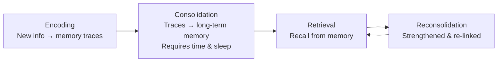

# 🎧 Make It Stick: The Science of Successful Learning — Audio Listening Edition

> [!IMPORTANT] **Listener's Note**
> This is a spoken-word edition designed for TTS playback. The narrative flows as continuous prose. Visual elements (callouts, diagrams, tables) are included for reference in the written version but are not part of the spoken track.

---

## Part One: The Big Idea & Why It Matters

Welcome to this audio listening edition of *Make It Stick: The Science of Successful Learning*, by Peter C. Brown, Henry L. Roediger III, and Mark A. McDaniel. Published in 2014, this book is a landmark work in cognitive science and education, and it delivers a message that is both simple and deeply unsettling: most of what we believe about how to learn is wrong.

The central premise is that our most common study habits—rereading, highlighting, cramming, and massed repetition—create what the authors call an illusion of mastery. We feel fluent. We feel confident. We feel like we know the material. But when we actually need to recall that information in a test, a presentation, or a real-world situation, it evaporates. The fluency we felt was a trick of the mind, not genuine learning.

The authors bring together decades of empirical research to show that effective learning is counter-intuitive. The strategies that feel most productive in the moment are often the least effective over time. And the strategies that feel difficult, frustrating, and slow are often the ones that build durable, flexible, transferable knowledge.

This matters for everyone. For students, it means the difference between passing an exam and actually understanding the material. For teachers and trainers, it means redesigning how they deliver content. For professionals, it means learning new skills that stick, not just for the next quarter but for a career. And for lifelong learners, it means finally understanding how to learn anything—a language, an instrument, a new field—with genuine depth.

The transformation this book offers is profound. It shifts you from a passive consumer of information to an active architect of your own understanding. It replaces the comfort of familiarity with the productive struggle of retrieval. And it gives you a set of evidence-based tools that will change not just what you know, but how you know it.

---

## Part Two: Core Principles & Mechanisms

To understand why these strategies work, we need to understand how learning actually happens in the brain. The authors describe a three-part process.

First, there is encoding. When you encounter new information, your brain receives it as chemical and electrical signals, and it creates memory traces—mental representations of the patterns you have observed. These traces live in your short-term working memory, and most of them are quickly forgotten.

Second, there is consolidation. This is the process by which material is placed into long-term memory. During consolidation, your memory traces are reorganized and connected to past experiences and knowledge, giving them meaning and context. This process strengthens and stabilizes the traces. Crucially, consolidation happens over time, and it is heavily dependent on sleep. This is why cramming is so ineffective—it does not allow time for consolidation to occur.

Third, there is retrieval. This is the act of pulling material back out of long-term memory. And here is the key insight: retrieval is not just a test of what you know. It is a learning event in itself. Every time you successfully retrieve a memory, you strengthen it and reconsolidate it, connecting it to new learning. This is the foundation of what cognitive scientists call the testing effect.



The authors build on this foundation with a concept borrowed from Robert Bjork: desirable difficulties. These are learning conditions that feel harder in the moment but produce superior long-term retention. They include spacing your study sessions, interleaving different topics, and testing yourself rather than rereading. The difficulty is desirable because it forces your brain to work harder, and that effort is what builds durable memory.

Another core principle is neuroplasticity. The authors are emphatic that intelligence is not fixed. Learning physically changes the brain—it strengthens neural pathways, builds new connections, and increases what researchers call cognitive capacity. This is not a metaphor; it is a biological fact. And it means that every person, regardless of their starting point, can become a better learner.

Finally, there is metacognition—the ability to monitor and direct your own learning. Most of us are terrible at this. We misjudge what we know, we overestimate our mastery, and we fail to notice our blind spots. The authors argue that accurate self-assessment is a skill that must be deliberately cultivated, and the best tool for it is testing—not as a punishment, but as a mirror.

> [!QUOTE] **Core Principle**
> "Effortful retrieval, spaced over time, interleaved across topics, and guided by accurate self-assessment, is the most reliable route to durable mastery."

---

## Part Three: Chapter Breakdowns & Key Arguments

Let me walk you through the book's eight chapters, each of which builds on the last.

Chapter one, *Learning Is Misunderstood*, sets the stage. The authors introduce the illusion of mastery and explain why our intuitions about learning are so often wrong. They open with the story of a pilot who survived a crash because of training that was difficult and confusing at the time—training that saved his life precisely because it was hard. This chapter establishes the core theme: effortful learning is lasting learning.

Chapter two, *To Learn, Retrieve*, is the heart of the book. The authors present the testing effect with compelling evidence. In one of the most famous studies, students who read a passage and then took a test recalled significantly more a week later than students who read the passage multiple times. The act of retrieval—even when it feels like a struggle—is the single most powerful learning tool we have. The authors recommend self-quizzing, low-stakes testing, and the practice of recalling material before looking at it again.

Chapter three, *Mix Up Your Practice*, tackles spacing and interleaving. Spacing means spreading your study sessions over time rather than cramming. Interleaving means mixing different topics or skills in a single session, rather than practicing one thing in a block. The authors use the example of baseball players who practice against a variety of pitches, and art students who study paintings by different artists in a mixed order. In both cases, the interleaved practice produced superior performance—because it forced the brain to discriminate between different cases and build more flexible mental models.

Chapter four, *Embrace Difficulties*, explains why struggle is not a sign of failure but a sign of learning. The authors cover the generation effect—the finding that trying to solve a problem before being shown the solution produces better learning than simply being shown the solution. They also discuss the importance of reflection, and the role of sleep in consolidating what you have learned.

Chapter five, *Avoid Illusions of Knowing*, is a warning. The authors catalog the many ways our minds deceive us: fluency, familiarity, and the curse of knowledge. They explain why rereading feels productive but is not, and why highlighting and underlining are nearly useless. The antidote is calibration—using tests and feedback to get an accurate picture of what you actually know.

Chapter six, *Get Beyond Learning Styles*, is a direct assault on a popular myth. The authors present the evidence that learning styles—visual, auditory, kinesthetic—are not supported by research. People do have preferences, but matching instruction to those preferences does not improve learning. What matters is the nature of the material and the strategy you use, not your preferred sensory modality.

Chapter seven, *Increase Your Abilities*, is the most inspiring chapter. The authors argue that intelligence is not fixed, and they present evidence from neuroscience and psychology that deliberate practice, effort, and the right strategies can literally change your brain. They discuss the growth mindset, the importance of embracing challenges, and the role of practice in building expertise.

Chapter eight, *Make It Stick*, is the practical synthesis. The authors bring everything together into a set of concrete strategies for learners, teachers, and trainers. They emphasize that learning is not a spectator sport—it requires active engagement, effortful retrieval, and a willingness to be wrong.

---

## Part Four: Real-World Applications & Action Protocols

So how do you actually use this? Let me give you a practical protocol.

For students, the single most important change is to replace rereading with retrieval practice. After you read a section, close the book and write down everything you can remember. Then check. This is called the free recall method, and it is brutally effective. Second, space your study sessions. Instead of studying for four hours the night before an exam, study for one hour on four consecutive days. Third, interleave your subjects. If you are studying biology and history, alternate between them rather than doing all of one and then all of the other. Fourth, test yourself constantly. Use flashcards, practice questions, or simply explain the material out loud as if you were teaching it to someone else.

For teachers and trainers, the implications are equally clear. Stop relying on lectures and presentations as the primary mode of delivery. Build in frequent low-stakes quizzes. Use the brain dump technique—ask students to write down everything they remember from the previous session. Design practice problems that mix different concepts. And resist the urge to make learning easy. The goal is not student satisfaction in the moment; it is durable learning over time.

For professionals, the same principles apply. When you are learning a new skill, do not just watch tutorials. Try to do it yourself first, then check the tutorial. Space your practice sessions. Mix different aspects of the skill. And reflect regularly—ask yourself what worked, what did not, and what you would do differently.

> [!TIP] **The Eight-Step Learning Protocol**
> - [ ] **Test before you study** — recall what you already know about the topic.
> - [ ] **Retrieve after you study** — close the material and recall it from memory.
> - [ ] **Space your sessions** — spread practice over days and weeks, not hours.
> - [ ] **Interleave topics** — mix different subjects or skills in one session.
> - [ ] **Embrace the struggle** — if it feels hard, you are learning.
> - [ ] **Seek feedback** — use tests and corrections to calibrate your understanding.
> - [ ] **Sleep well** — consolidation happens while you sleep.
> - [ ] **Teach someone else** — explaining is the ultimate test of understanding.

---

## Part Five: Critical Perspectives & Limitations

No book is without its limitations, and *Make It Stick* is no exception. It is important to approach these strategies with nuance.

First, the research is primarily conducted in laboratory settings and controlled classroom studies. The effect sizes are real and replicable, but real-world learning is messier. Motivation, prior knowledge, and the nature of the material all interact with these strategies in complex ways.

Second, the authors are sometimes dismissive of strategies that have legitimate uses. Highlighting, for example, is nearly useless as a primary study strategy, but it can be a useful tool for marking passages you want to return to. Rereading is ineffective as a primary strategy, but it can be valuable when combined with retrieval practice. The key is not to abandon these tools entirely, but to understand their proper role.

Third, the book's emphasis on effort and difficulty can be misinterpreted. Not all difficulty is desirable. The difficulty must be productive—it must be the kind of struggle that comes from retrieval, generation, and discrimination, not the kind that comes from confusion, poor instruction, or lack of prior knowledge. The authors are clear about this, but it is a nuance that is easy to lose in practice.

Fourth, the book is written for a general audience, and it sometimes oversimplifies the underlying science. The research on learning is ongoing, and some of the specific claims—particularly around neuroplasticity and the growth mindset—are more contested than the book suggests.

Finally, there is a practical challenge. These strategies are harder to implement than the ones they replace. They take more time, more effort, and more discomfort. In a world of deadlines and busy schedules, it is tempting to fall back on the familiar habits of cramming and rereading. The authors would say that this is precisely the point—the difficulty is the price of durable learning.

| Common Strategy | Why It Fails | Effective Alternative |
|---|---|---|
| Rereading | Creates fluency illusion; no retrieval effort | Free recall / self-testing |
| Highlighting | Passive; no discrimination required | Summarize in your own words |
| Massed practice (cramming) | No time for consolidation | Spaced practice over days |
| Blocked practice | No discrimination between cases | Interleaved practice |
| Learning styles matching | No evidence of benefit | Match strategy to material |

---

## Part Six: Final Synthesis & Core Takeaway

Let me bring this to a close with the core message of *Make It Stick*.

Learning is not about feeling fluent. It is not about the comfort of familiarity. It is about building durable, flexible, transferable knowledge that you can call up when you need it. And the path to that kind of learning runs directly through difficulty.

The authors' message can be distilled into a single sentence: effortful retrieval, spaced over time, interleaved across topics, and guided by accurate self-assessment, is the most reliable route to durable mastery.

This is a message that runs against our intuitions. It tells us that the strategies that feel good are often the ones that fail us, and the strategies that feel hard are often the ones that work. But it is also a message of hope. It tells us that learning is not a fixed trait—it is a skill that can be developed. It tells us that we are not stuck with the brains we were born with. And it tells us that every one of us, with the right strategies and the right effort, can learn anything.

So the next time you sit down to study, do not reach for the highlighter. Do not reread the same passage for the third time. Instead, close the book. Test yourself. Struggle a little. Space your sessions. Mix your subjects. And trust the process.

That is the science of successful learning. And now you know how to make it stick.

> [!NOTE] **Related Reading**
> Explore [[Make-It-Stick|Make It Stick]] alongside other works in the Learning Science pillar, such as [[Atomic-Habits|Atomic Habits]] for habit formation or [[Deep-Work|Deep Work]] for focused practice.
```

---

## 🧭 Sequential Navigation
| Previous | Up | Next |
| :--- | :---: | :--- |
| [[04-Mindsets-and-Implementation|⬅️ Previous: Final Concept]] | [[README|🏠 Book Hub]] | [[Quiz|🧩 Next: Knowledge Assessment Quiz]] |
