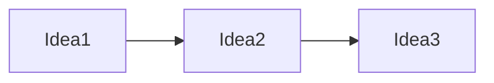

# Book Title

> One original sentence explaining why this book matters.

## Quick Take

A concise overview of the entire book — works for a reader with five minutes.

## Why Read This Book?

- Why the book became important.
- Who should read it and what they gain.
- Who might not benefit from it.
- Any important limitations.

## The Central Question

What problem, question, or challenge is the author addressing?

## The Core Thesis

The main argument in plain language.

## The Big Picture

How the major ideas fit together — a conceptual narrative, not a list.

## Key Ideas

### 1. Key Idea Name

What it means, why it matters, and how the author supports it — with evidence and examples.

## Evidence and Examples

What supports the claims, and how strong that evidence is.

## Criticism and Limitations

What critics dispute, what may be outdated, and where the argument has boundary conditions.

## Practical Use

What the reader can actually do with this knowledge.

## Connections to Other Books in This Vault

Weave at least three [[wikilinks]] into this section, naming each intellectual relationship (agreement, extension, contradiction, prerequisite).

## If You Remember Only Five Things

1. ...
2. ...
3. ...
4. ...
5. ...

Audio description: explain the diagram in words for text-to-speech.

## TTS-Friendly Recap

A spoken summary of the entire note, written to be read aloud.

## Related Books

- [[Related-Book-Slug|Related Book]] — why it connects.

## Sources and Further Reading

- Author or publisher official page: URL
- Reliable secondary source: URL

## Navigation

← Previous: [[Previous-Book|Previous Book]]
↑ Category: [[Pillar-README|Pillar]]
→ Next: [[Next-Book|Next Book]]
